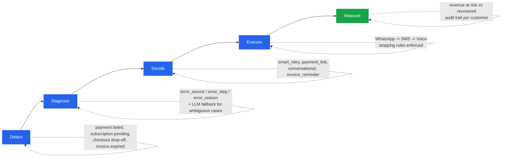
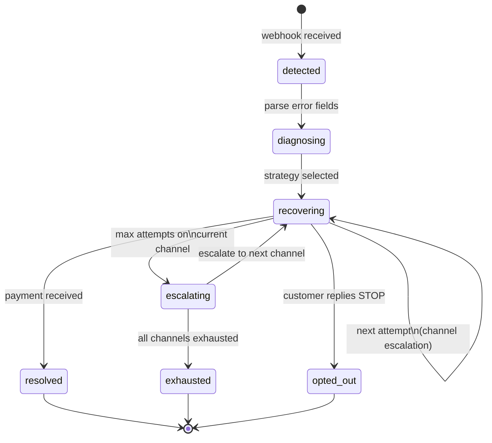

<div align="center">

# RecoverAI

### Find revenue that's slipping away. Win it back.

**Razorpay AI Buildathon 2026 — Track 3: AI Revenue Recovery**

[Documentation](docs/PROJECT_DOCUMENTATION.md) · [Product Spec](docs/PRD.md) · [Task Board](https://github.com/archittmittal/Recover-AI/issues)

</div>

---

Revenue loss in Indian digital commerce rarely happens in one clean step. A payment degrades. A checkout gets abandoned. A subscription mandate fails. An invoice goes overdue. Each is a small leak — together they cost merchants real money, silently.

**RecoverAI is an autonomous agent that closes the loop.** It detects revenue at risk, diagnoses the root cause, decides on the right intervention, and executes a bounded, compliant recovery workflow — until the money is back, or the agent stops on a hard rule.

It does not just flag the problem. It shows **measured money recovered across a batch**, with compliant escalation, stopping rules, and a full audit trail — the exact bar the track sets.

---

## How it works



Every step writes to an immutable audit log, so any decision the agent makes — why it classified a failure the way it did, why it picked a channel, why it stopped — is fully explainable after the fact.

---

## Recovery journey state machine



---

## Recovery scenarios covered

| Scenario | Trigger | Recovery action |
| :--- | :--- | :--- |
| Failed one-time payment | `payment.failed` | Classify, generate payment link, dispatch via WhatsApp/SMS |
| Subscription charge failure | `subscription.pending` | Smart retry schedule plus dunning sequence |
| Subscription halted | `subscription.halted` | Final recovery link plus plan downgrade offer |
| Checkout abandonment | No payment within threshold | Personalized reminder with cart contents and incentive |
| Overdue B2B invoice | Invoice `expire_by` passed | Escalating reminder cadence via Invoice Notify API |

---

## Stopping rules

The agent halts outreach immediately, no exceptions, when any of these fire:

| Rule | Trigger | Result |
| :--- | :--- | :--- |
| Payment success | `payment_link.paid` / `subscription.charged` | Journey marked resolved, amount logged |
| Customer opt-out | Customer replies "STOP" | Journey marked opted_out, DND set on record |
| Attempt exhaustion | 3 attempts reached across all channels | Journey marked exhausted, added to exception list |
| Contact hours | Outside 8 AM to 7 PM IST | Action deferred to next valid window |
| DND customer | Customer already opted out | All outreach skipped, skip reason logged |

## Compliance

Built against RBI fair-practice guidelines for outreach, TRAI DLT template rules for SMS, and DPDPA data-minimization principles — never sending PII beyond what a message needs. Full framework in [`docs/PROJECT_DOCUMENTATION.md`](docs/PROJECT_DOCUMENTATION.md#9-compliance-framework).

---

## Tech stack

| Layer | Technology |
| :--- | :--- |
| Framework | Next.js 15, App Router, TypeScript |
| Styling | Tailwind CSS, shadcn/ui |
| Database | SQLite via `better-sqlite3` |
| ORM | Drizzle ORM |
| AI / LLM | Google Gemini API (`gemini-2.5-flash`) |
| Charts | Recharts |
| Payments | Razorpay APIs, test mode — Payment Links, Invoices, Subscriptions, Webhooks |

---

## Getting started

```bash
git clone https://github.com/archittmittal/Recover-AI.git
cd Recover-AI
npm install
cp .env.example .env   # add your Razorpay test keys + Gemini API key
npm run dev
```

Open [http://localhost:3000](http://localhost:3000).

No Docker, no external database — SQLite is a single committed file. Zero-config by design, so evaluating this takes minutes, not a setup session.

### Demo flow

1. **Seed the batch** — click "Seed 50+ Failures" on the simulator page.
2. **Run the agent** — click "Start Recovery" to process every failure.
3. **Watch the dashboard** — revenue at risk vs. recovered updates live.
4. **Play as a customer** — reply to agent messages, test the "STOP" opt-out.
5. **Review the audit trail** — open any customer for the full decision timeline.
6. **Check the exception list** — see unrecoverable failures with honest reasons.

---

## Project structure

```
recover-ai/
├── src/
│   ├── app/                  # Next.js App Router pages + API routes
│   ├── lib/
│   │   ├── db/                # Drizzle schema, connection, seed data
│   │   ├── recovery/           # State machine, classifier, strategy engine, scheduler
│   │   ├── ai/                 # Gemini client, prompts, LLM classifier/messenger
│   │   ├── razorpay/           # API client, webhook verification, payment links
│   │   ├── communication/      # WhatsApp / SMS / Voice dispatch simulators
│   │   └── utils/              # Audit logger, ID generation, IST time helpers
│   └── components/
│       ├── dashboard/          # Metrics, recovery chart, channel comparison
│       ├── customers/          # Customer table, audit timeline
│       └── simulator/          # Batch controls, customer chat simulator
```

Full architecture, database schema (ERD), state machine, and strategy-selection rules live in [`docs/PROJECT_DOCUMENTATION.md`](docs/PROJECT_DOCUMENTATION.md).

---

## Project tracking

Every task in [`docs/TASKS.md`](docs/TASKS.md) has a matching [GitHub Issue](https://github.com/archittmittal/Recover-AI/issues). The workflow:

1. Pick up an issue, branch off `main` (e.g. `feat/2.11-recovery-coordinator`).
2. Open a PR whose description includes `Closes #<issue-number>`.
3. Merging the PR auto-closes the issue — so the issue list is always a live, accurate picture of what's actually shipped, not just planned.

---

## Documentation

- [`docs/PRD.md`](docs/PRD.md) — product requirements, success criteria, milestones
- [`docs/PROJECT_DOCUMENTATION.md`](docs/PROJECT_DOCUMENTATION.md) — architecture, schema, compliance, LLM prompts
- [`docs/TASKS.md`](docs/TASKS.md) — full task breakdown, mirrored as GitHub Issues

## License

Built for the Razorpay AI Buildathon 2026. Not licensed for production use.
