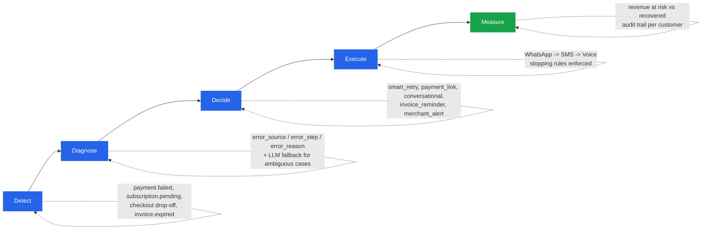
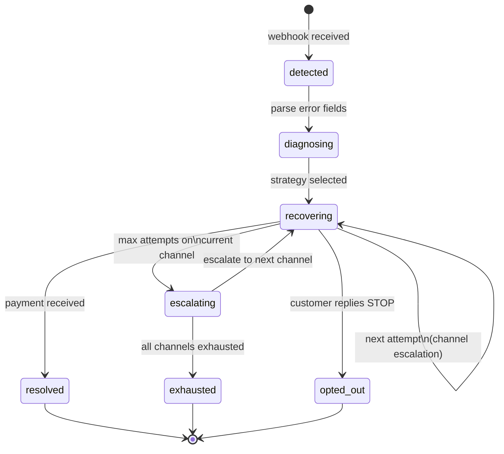

<div align="center">

# RecoverAI

### Find revenue that's slipping away. Win it back.

**Razorpay AI Buildathon 2026 — Track 3: AI Revenue Recovery**

**[▶ Live demo](https://recover-ai-gules.vercel.app)** · [Documentation](docs/PROJECT_DOCUMENTATION.md) · [Product Spec](docs/PRD.md) · [Task Board](https://github.com/archittmittal/Recover-AI/issues)

[](https://github.com/archittmittal/Recover-AI/security/code-scanning?query=tool%3AScorecard)
[](https://github.com/archittmittal/Recover-AI/actions/workflows/codeql.yml)
[](https://github.com/archittmittal/Recover-AI/actions/workflows/ci.yml)
[](https://github.com/archittmittal/Recover-AI/actions/workflows/security.yml)

</div>

---

Revenue loss in Indian digital commerce rarely happens in one clean step. A payment degrades. A checkout gets abandoned. A subscription mandate fails. An invoice goes overdue. Each is a small leak — together they cost merchants real money, silently.

**RecoverAI is an autonomous agent that closes the loop.** It detects revenue at risk, diagnoses the root cause, decides on the right intervention, and executes a bounded, compliant recovery workflow — until the money is back, or the agent stops on a hard rule.

It does not just flag the problem. It shows **measured money recovered across a batch**, with compliant escalation, stopping rules, and a full audit trail — the exact bar the track sets.

---

## How it works



Every step writes to an immutable audit log, so any decision the agent makes — why it classified a failure the way it did, why it picked a channel, why it stopped — is fully explainable after the fact.

---

## Recovery journey state machine



---

## Recovery scenarios covered

| Scenario | Trigger | Recovery action | Status |
| :--- | :--- | :--- | :--- |
| Failed one-time payment | `payment.failed` webhook | Classify, generate a Razorpay payment link, dispatch via WhatsApp → SMS → voice | **Live** |
| Recovered payment | `payment_link.paid` / `payment.captured` webhook | Journey resolved, attributed to the outreach that earned it | **Live** |
| Subscription / mandate failure | `payment.failed` on an `emandate` payment | Classified as `smart_retry` or `conversational` by cause, then the same dunning ladder | **Live** |
| Checkout abandonment | No payment within a 30-minute threshold | Sweep creates the journey and dispatches attempt 1 | **Live** |
| Overdue B2B invoice | Seeded as an `invoice_overdue` failure | `invoice_reminder` strategy — email first, then WhatsApp, then voice, on a 24h/168h/336h cadence | **Live** |
| `subscription.pending` / `subscription.halted` | — | Recorded in `webhook_events` and **not acted on**. Subscribing to them changes nothing today | **Not built** |

The subscription-lifecycle events are listed rather than omitted because `docs/DEPLOYMENT.md` used
to tell operators to subscribe to them and described behaviour that did not exist. Mandate
failures *are* recovered — they arrive as `payment.failed` on an `emandate` payment, which is the
path that actually fires.

---

## Stopping rules

The agent halts outreach immediately, no exceptions, when any of these fire:

| Rule | Trigger | Result |
| :--- | :--- | :--- |
| Payment success | `payment_link.paid` / `payment.captured` webhook, or the simulator's Pay button | Journey marked resolved, amount logged, conversion attributed to the outreach that earned it |
| Customer opt-out | Customer replies "STOP" | Journey marked opted_out, DND set on record |
| Attempt exhaustion | 3 attempts reached across all channels | Journey marked exhausted, added to exception list |
| Contact hours | Outside 8 AM to 7 PM IST | Action deferred to next valid window |
| DND customer | Customer already opted out | All outreach skipped, skip reason logged |

## Compliance

Built against RBI fair-practice guidelines for outreach, TRAI DLT template rules for SMS, and DPDPA data-minimization principles — never sending PII beyond what a message needs. Full framework in [`docs/PROJECT_DOCUMENTATION.md`](docs/PROJECT_DOCUMENTATION.md#9-compliance-framework).

---

## How the results are measured

A recovery rate quoted on its own is unfalsifiable. "We recovered 62%" invites the immediate question *versus what*, and without an answer the number says nothing about whether the agent is doing anything useful.

Every batch therefore runs three arms over identical seeded data:

| Arm | Behaviour | Question it answers |
| :--- | :--- | :--- |
| A. No agent | Detect and record; never reach out | What does doing nothing cost? |
| B. Rules only | Fixed cadence, one message for everyone, no LLM | How much comes from any dunning at all? |
| C. Full agent | Classification, per-failure strategy, personalised copy, escalation | What does the intelligence add? |

**The honest headline is C minus B.** Arm B is what a cron job and a message template would have achieved on their own; only the delta is attributable to the agent's judgment. The comparison is built before any numbers exist, so the framing cannot be picked after the fact — and if C turns out to be roughly equal to B, that gets reported too.

That promise has already been tested. Under response model v1.0.0 the harness measured **C − B = −7.1 points** across 25 replications: the agent *lost* to the baseline. Rather than bury it, we found the cause — the model's channel term was a single unconditional ranking, so escalating off WhatsApp could only cost, and email was scored badly even for a B2B invoice — declared the fix in an issue **before** touching the model, and re-measured at **+2.8 points**. [`docs/SIMULATION_MODEL.md`](docs/SIMULATION_MODEL.md) carries both numbers, the per-term ablation showing neither change is significant alone, and the plain admission that most of the swing is Arm B falling rather than Arm C rising. Reproduce it yourself with `npm run eval:arms`.

The batch is synthetic, so simulated customer behaviour follows a declared response model — a cause-specific base rate scaled by channel, attempt number, customer segment, and whether the copy came from the LLM or the template fallback — documented coefficient-by-coefficient in [`docs/SIMULATION_MODEL.md`](docs/SIMULATION_MODEL.md) and driven by a fixed seed. **Every coefficient is an estimate, not a measurement**, and the doc labels each one as such; they are declared in advance so the comparison they feed cannot be tuned after the results are in. The agent cannot import that model, and the model cannot import the agent — both directions are asserted by tests, because otherwise it would be marking its own homework. Every figure in the dashboard is labelled as simulation output against that model, never as recovered rupees.

---

## Where we deliberately did not use AI

The track scores the right tool in the right place, **and where you chose not to use one**. The governing principle here: an LLM is used where language or ambiguity is the problem, and never where correctness, auditability, or money is the problem.

| Deterministic, no LLM | Why |
| :--- | :--- |
| Stopping rules | Safety invariants. A model that honours an opt-out 99% of the time is a compliance incident 1% of the time |
| Contact-hours gating | A regulatory time window is arithmetic, not judgment |
| Monetary amounts | Always read from the database. A hallucinated figure in a payment message is unrecoverable |
| Retry scheduling | Fixed cadence aligned to Razorpay's own retry windows |
| Metrics | Numbers an evaluator will check must be computed, not narrated |
| Classification (common path) | Razorpay's error fields are already a structured taxonomy — a lookup beats a model on speed, cost, and accuracy |

The LLM handles message composition, genuinely ambiguous classification, and free-text customer replies. It is never load-bearing for correctness: every LLM path has a deterministic fallback, so a Gemini outage degrades message quality without stopping recovery. And it cannot move money or override a stop — those are code paths it has no ability to reach.

Full reasoning in [`docs/PROJECT_DOCUMENTATION.md`](docs/PROJECT_DOCUMENTATION.md#85-where-we-deliberately-did-not-use-ai).

---

## Tech stack

| Layer | Technology |
| :--- | :--- |
| Framework | Next.js 16, App Router, TypeScript |
| Styling | Tailwind CSS, shadcn/ui |
| Database | SQLite via `better-sqlite3` locally; libSQL / Turso when deployed — the driver is chosen from the `DATABASE_URL` scheme |
| ORM | Drizzle ORM, migrations as the single source of schema truth |
| AI / LLM | Google Gemini API (`gemini-3.6-flash`, set via `GEMINI_MODEL`) |
| Charts | Recharts |
| Payments | Razorpay APIs, test mode — Payment Links, Invoices, Subscriptions, Webhooks |

---

## Getting started

```bash
git clone https://github.com/archittmittal/Recover-AI.git
cd Recover-AI
npm install
cp .env.example .env   # add your Razorpay test keys + Gemini API key
npm run dev
```

Open [http://localhost:3000](http://localhost:3000) and sign in.

Every page and every API route except the Razorpay webhook and the demo simulator requires a
dashboard session (RA-05) — `/api/customers` returns real customer names, emails and phone
numbers, and `/api/recovery/trigger` makes the system contact people, so neither is anonymous.
Set `SESSION_SECRET`, `DASHBOARD_USERNAME` and `DASHBOARD_PASSWORD` in `.env` before first run;
`.env.example` documents all three.

No Docker, no external database. The SQLite file is created on first connection and migrated to
the current schema automatically, so evaluating this takes minutes, not a setup session — there is
no separate `db:migrate` step to remember. Nothing under `data/` is committed: the database is
generated, and `.gitignore` keeps it that way.

**`RECOVERAI_MODE` decides whether anything leaves the process.** `mock` (the default) makes no
outbound calls at all: payment links are fabricated and the deterministic template copy ships, so
a clone with no credentials still runs the whole workflow. `live` uses the real Razorpay test-mode
API and the real Gemini model. The mode is declared, never inferred from whether a credential
happens to look real — so *running in mock means running no AI*, which is worth knowing before
judging the output.

### Demo flow

1. **Seed the batch** — click "Seed 50+ Failures" on the simulator page. The same 50 failures are
   materialised into all three experiment arms, so the comparison starts from identical data.
2. **Run the agent** — click "Run AI Recovery Agent" to process every failure.
3. **Inject a signed webhook** — the simulator signs a `payment.failed` delivery server-side and
   feeds it to the real handler, so signature verification is exercised rather than bypassed.
4. **Cross the contact-hours boundary** — advance the simulated clock to 21:00 IST and run the
   agent: every outreach defers with its rule logged. Advance to 09:00 and the same queue
   dispatches. Every jump is written to the audit trail as `clock_advanced`, and time only moves
   forward, so nothing can be replayed to inflate a result.
5. **Watch the dashboard** — revenue at risk vs. recovered, and the three-arm comparison with
   `n` per arm.
6. **Play as a customer** — reply to agent messages, test the "STOP" opt-out.
7. **Review the audit trail** — open any customer for the full decision timeline, including the
   model's own reasoning for each message.
8. **Check the exception list** — see unrecoverable failures with honest reasons.

---

## Project structure

```
recover-ai/
├── src/
│   ├── app/                  # Next.js App Router pages + API routes
│   ├── lib/
│   │   ├── db/                # Drizzle schema, connection, seed data
│   │   ├── recovery/           # State machine, classifier, strategy engine, scheduler
│   │   ├── ai/                 # Gemini client, prompts, LLM classifier/messenger
│   │   ├── razorpay/           # API client, webhook verification, payment links
│   │   ├── communication/      # WhatsApp / SMS / Voice dispatch simulators
│   │   └── utils/              # Audit logger, ID generation, IST time helpers
│   └── components/
│       ├── dashboard/          # Metrics, recovery chart, channel comparison
│       ├── customers/          # Customer table, audit timeline
│       └── simulator/          # Batch controls, customer chat simulator
```

Full architecture, database schema (ERD), state machine, and strategy-selection rules live in [`docs/PROJECT_DOCUMENTATION.md`](docs/PROJECT_DOCUMENTATION.md).

---

## Project tracking

Every task in [`docs/TASKS.md`](docs/TASKS.md) has a matching [GitHub Issue](https://github.com/archittmittal/Recover-AI/issues). The workflow:

1. Pick up an issue, branch off `main` (e.g. `feat/2.11-recovery-coordinator`).
2. Open a PR whose description includes `Closes #<issue-number>`.
3. Merging the PR auto-closes the issue — so the issue list is always a live, accurate picture of what's actually shipped, not just planned.

---

## Documentation

- [`docs/PRD.md`](docs/PRD.md) — product requirements, success criteria, judging-criteria map, milestones
- [`docs/PROJECT_DOCUMENTATION.md`](docs/PROJECT_DOCUMENTATION.md) — architecture, schema, compliance, LLM prompts, evaluation design
- [`docs/SIMULATION_MODEL.md`](docs/SIMULATION_MODEL.md) — every coefficient behind the simulated outcomes, each labelled an estimate, plus the measured three-arm result and its history
- [`docs/AI_DECISIONS.md`](docs/AI_DECISIONS.md) — where an LLM is used, and where it deliberately is not
- [`docs/ETHICAL_AI_FRAMEWORK.md`](docs/ETHICAL_AI_FRAMEWORK.md) — consent, stopping rules, data minimisation
- [`docs/DEPLOYMENT.md`](docs/DEPLOYMENT.md) — Turso + Vercel, webhook configuration, environment variables
- [`docs/DEMO_SCRIPT.md`](docs/DEMO_SCRIPT.md) — scene-by-scene walkthrough of the five-minute demo
- [`docs/ENGINEERING_LOG.md`](docs/ENGINEERING_LOG.md) — what broke, and how we got out
- [`docs/TASKS.md`](docs/TASKS.md) — full task breakdown, mirrored as GitHub Issues

## License

Built for the Razorpay AI Buildathon 2026. Not licensed for production use.
