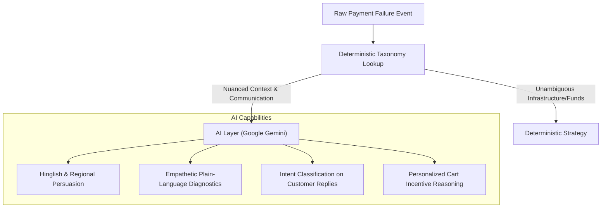
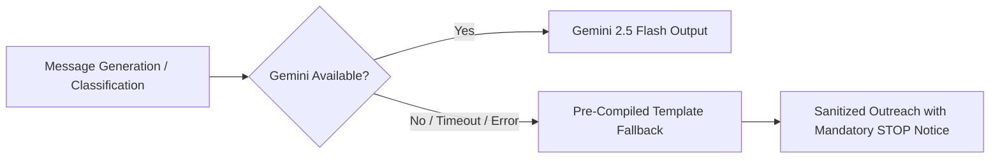

# AI Architecture & Decision Boundaries in RecoverAI

> **Core Philosophy**: *AI is a persuasion and comprehension tool, NOT an unconstrained governor of financial state machines or regulatory compliance.*

In financial recovery systems operating under **Reserve Bank of India (RBI)** regulations and **Digital Personal Data Protection Act (DPDPA)** standards, allowing an unconstrained LLM to control compliance boundaries, money arithmetic, or state machine transitions introduces intolerable hallucination risks.

This document outlines the explicit architectural boundary between **where we use AI** and **where we deliberately enforce deterministic rules**.

---

## 1. Where We Use AI (Google Gemini 2.5 Flash)

### A. Contextual, Multi-Lingual Message Generation
- **Problem**: Standard recovery emails ("Your payment failed, click here") have an average conversion rate of <15%. Customers ignore generic dunning.
- **AI Solution**: Gemini generates empathetic, concise WhatsApp and SMS messages in the customer's preferred language (**English, Hindi, or Hinglish**).
- **Context Provided to LLM**:
  - Customer First Name
  - Amount in Rupees (formatted)
  - Failure Reason (e.g., `insufficient_funds`, `authentication_failed`)
  - Preferred Channel & Language
  - Payment Link URL
- **Strict Guardrail**: **Zero PII (card numbers, full phone, email, bank details) is ever sent to the LLM**.

### B. Conversational Intent Parsing & Objection Handling
- **Problem**: Customers reply with complex statements like:
  - *"Can I pay half now and half next Monday when my salary credits?"*
  - *"Why was my HDFC debit card declined when I had money?"*
  - *"Send me a Google Pay UPI link instead."*
- **AI Solution**: The conversational agent parses customer intent (`pay_later`, `technical_issue`, `alternative_method`) and crafts an empathetic explanation with actionable recovery steps.

### C. Plain-Language Decline Diagnostics
- **Problem**: Error codes like `BAD_REQUEST_ERROR / authorization / customer` alienate non-technical consumers.
- **AI Solution**: Translates cryptic banking errors into plain, respectful Indian consumer guidance (e.g. explaining 3D-Secure OTP expiry or bank server timeouts without placing blame).

---

## 2. Where We Deliberately Did NOT Use AI (Deterministic Code)

| System Domain | Why AI Was Excluded | Deterministic Enforcement |
| :--- | :--- | :--- |
| **RBI Contact Hours (8 AM - 7 PM IST)** | A hallucinated timestamp or time-zone miscalculation would violate regulatory harassment rules. | Hard mathematical evaluation on `Clock.now()` in `Asia/Kolkata` time zone ([`src/lib/utils/time.ts`](../src/lib/utils/time.ts)). |
| **All 5 Stopping Rules** | Opt-out ("STOP"), payment success, DND, and 3-attempt exhaustion must halt instantly without LLM latency or ambiguity. | Hardcoded safety engine ([`src/lib/recovery/stopping-rules.ts`](../src/lib/recovery/stopping-rules.ts)). |
| **Financial Calculations (Paise Arithmetic)** | LLMs suffer from token-arithmetic hallucinations (e.g., `499900` paise = ₹4,999.00). | Integer arithmetic in TypeScript and Drizzle ORM queries; amounts never computed by prompts. |
| **State Machine Transitions** | Allowing an LLM to freely set database states could cause illegal transitions (e.g., `exhausted` -> `resolved`). | Strictly validated state transition machine ([`src/lib/recovery/coordinator.ts`](../src/lib/recovery/coordinator.ts)). |
| **HMAC Webhook Verification** | Cryptographic verification must be byte-level timing-safe. | `crypto.timingSafeEqual` over raw SHA-256 digests ([`src/lib/razorpay/webhooks.ts`](../src/lib/razorpay/webhooks.ts)). |
| **Infrastructure Error Retries** | Gateway, network, and bank downtime is transient; contacting the customer is counterproductive. | Deterministic taxonomy mapping routes to `smart_retry` with exponential backoff. |

---

## 3. Defense-in-Depth Fallback Matrix

If Google Gemini API is unavailable (network outage, rate limits, unconfigured key), RecoverAI guarantees **100% operational uptime** via deterministic fallbacks:

1. **Classification Fallback**: Falls back to [`classifyFailureDeterministic`](../src/lib/recovery/classifier.ts) with zero degradation for standard error sources.
2. **Copywriting Fallback**: Falls back to pre-compiled, linguistically verified templates in English, Hindi, and Hinglish.
3. **Conversational Fallback**: Preserves hardcoded regex matchers for `STOP`, `unsubscribe`, and `band karo` to guarantee stopping rules never fail.
