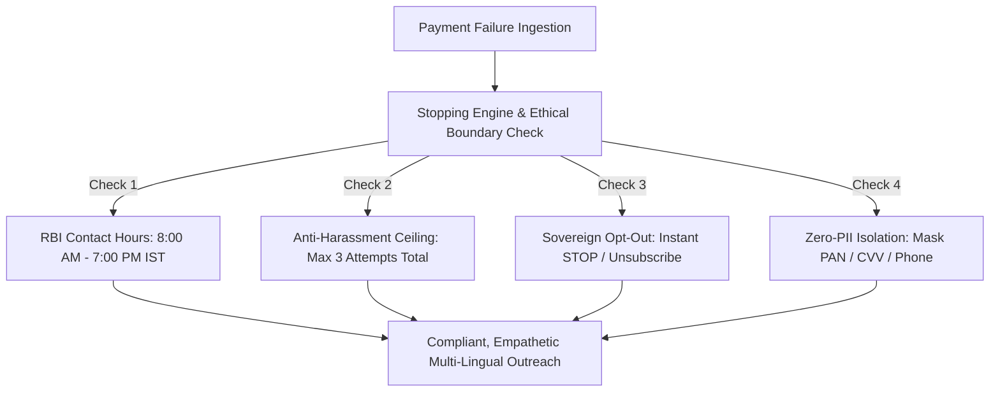

# RecoverAI: Ethical AI & Responsible Financial Recovery Framework

> **Guiding Principle**: *Revenue recovery must protect human dignity, respect consumer privacy, and strictly adhere to financial regulations. An AI agent must never harass, mislead, or trap consumers.*

In digital commerce, failed payments frequently occur due to banking network degradation, 3D-Secure authentication timeouts, or temporary cashflow timing—not intentional default. Traditional debt dunning and aggressive automated calling cause consumer distress and damage merchant trust.

**RecoverAI** implements an ethical, mathematically bounded recovery architecture designed specifically for the Indian regulatory landscape (**Reserve Bank of India Fair Practices Code** and **Digital Personal Data Protection Act 2023**).

---

## 1. The Four Non-Negotiable Ethical Invariants

### 🛡️ Invariant 1: Mathematical Anti-Harassment Ceiling
- **Hard Upper Bound**: Under no circumstances can any customer receive more than **3 outreach attempts** for a single failure.
- **Progressive Exponential Backoff**: Outreach attempts are strictly spaced:
  - **Attempt 1**: T + 0 (Immediate interactive notification on preferred channel)
  - **Attempt 2**: T + 24 hours (SMS reminder with discount incentive if permitted)
  - **Attempt 3**: T + 48 hours (Final conversational follow-up)
- **Automatic Exhaustion**: After Attempt 3, the journey status permanently transitions to `exhausted`, preventing any automated agent or cron job from contacting the customer again.

---

### 🛑 Invariant 2: Sovereign Customer Opt-Out (Right to be Forgotten)
- **Universal Opt-Out Keywords**: RecoverAI detects explicit opt-outs across English, Hindi, and Hinglish:
  - English: `STOP`, `UNSUBSCRIBE`, `CANCEL`, `QUIT`, `OPT OUT`
  - Hindi / Hinglish: `band karo`, `mat bhejo`, `message mat karo`, `unsubscribe karo`
- **Instantaneous Halting**: When an opt-out intent is detected:
  1. Customer's `dnd_status` is updated to `opted_out` in the database.
  2. The recovery journey immediately transitions to `opted_out`.
  3. All pending scheduled actions are purged.
  4. An immutable audit record `customer_opted_out` is generated.
- **Zero Dark Patterns**: Opt-out is immediate without confirmation loops or surveys.

---

### ⏰ Invariant 3: RBI Fair Practices Code & Contact Hours Compliance
- **Permitted Window**: Communications are strictly restricted to **8:00 AM to 7:00 PM IST** (`Asia/Kolkata` time zone).
- **Graceful Night-Time Deferral**: If a payment fails at 11:30 PM:
  - RecoverAI classifies the root cause and prepares the recovery link in the database.
  - Outbound communication is deferred until **8:00 AM the following morning**.
- **No Nighttime Disruption**: Prevents intrusive WhatsApp notifications or SMS alerts while customers are sleeping.

---

## 2. Data Minimization & Privacy (DPDPA 2023 Compliance)

| Requirement | Implementation in RecoverAI |
| :--- | :--- |
| **No Card PAN / CVV Storage** | Card PANs, CVVs, and banking PINs are never accepted or stored. All payment execution occurs exclusively on PCI-DSS certified Razorpay hosted pages. |
| **LLM Data Minimization** | Prompts to Google Gemini receive only sanitized metadata: first name, amount in paise, error taxonomy reason, and payment link URL. Full phone numbers and email addresses are omitted. |
| **Pseudonymized Identifiers** | Outreach message tracking IDs use cryptographically secure random UUIDs (`crypto.randomUUID()`) rather than phone number fragments. |
| **Transparent AI Identity** | Every message explicitly states the sender's identity and provides a direct, verifiable Razorpay link (`https://rzp.io/i/...`). |

---

## 3. Human Escalation & Dispute Safeguards

If a customer replies indicating a billing dispute (e.g., *"I was charged twice"*, *"I already paid this"*):
1. RecoverAI's conversational intent parser classifies the message as `dispute`.
2. The agent responds empathetically acknowledging the discrepancy.
3. The journey is flagged for merchant review without executing further automated payment retries.
4. The immutable audit timeline displays the customer's exact dispute message for merchant auditability.
