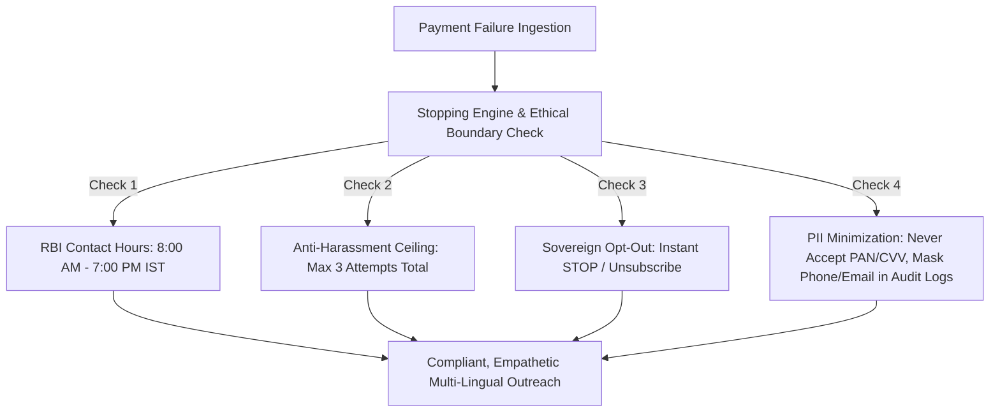

# RecoverAI: Ethical AI & Responsible Financial Recovery Framework

> **Guiding Principle**: *Revenue recovery must protect human dignity, respect consumer privacy, and strictly adhere to financial regulations. An AI agent must never harass, mislead, or trap consumers.*

In digital commerce, failed payments frequently occur due to banking network degradation, 3D-Secure authentication timeouts, or temporary cashflow timing—not intentional default. Traditional debt dunning and aggressive automated calling cause consumer distress and damage merchant trust.

**RecoverAI** implements an ethical, mathematically bounded recovery architecture designed specifically for the Indian regulatory landscape (**Reserve Bank of India Fair Practices Code** and **Digital Personal Data Protection Act 2023**).

---

## 1. The Four Non-Negotiable Ethical Invariants

### 🛡️ Invariant 1: Mathematical Anti-Harassment Ceiling
- **Hard Upper Bound**: `merchant_alert` allows a single attempt (nothing the customer can act on); every other strategy allows at most **3 outreach attempts** for a single failure (`src/lib/recovery/strategies.ts`, `STRATEGY_CONFIGS[*].maxAttempts`).
- **Backoff, Per Strategy**: Retry timing is strategy-specific, enforced against each action's recorded `scheduledAt` before the next attempt is allowed to dispatch (`src/lib/recovery/coordinator.ts`, see `tests/retry-backoff-enforcement.test.ts`):
  | Strategy | Attempt 1 | Attempt 2 (delay since Attempt 1) | Attempt 3 (delay since Attempt 2) |
  | :--- | :--- | :--- | :--- |
  | `payment_link` / `smart_retry` | T + 0 | + 1 hour | + 24 hours |
  | `conversational` | T + 0 | + 2 hours | + 24 hours |
  | `invoice_reminder` (B2B) | T + 0 | + 24 hours | + 168 hours |
  | `merchant_alert` | T + 0 | — | — |
- **Automatic Exhaustion**: After the strategy's final attempt, the journey status permanently transitions to `exhausted`, preventing any automated agent or cron job from contacting the customer again.

---

### 🛑 Invariant 2: Sovereign Customer Opt-Out (Right to be Forgotten)
- **Opt-Out Keywords**: The deterministic stopping-rule engine (`src/lib/recovery/stopping-rules.ts`) halts outreach and sets DND on `STOP`, `unsubscribe`, `band karo`, `mat bhejo` (see `tests/stopping-rules.test.ts`, `tests/ethical-compliance.test.ts`).
  Known gap tracked separately: the conversational agent (`src/lib/ai/conversation.ts`) currently matches a *different*, broader keyword list (also `cancel`, `mat karo`) than the deterministic engine — the two can disagree on the same message. Both matchers are also substring-based today, so e.g. "the bank **stop**ped my transaction" incorrectly triggers opt-out. A fix unifying both into a single word-boundary matcher — covering English, Hindi, Hinglish, and Devanagari script, plus phrasings like "do not contact me again" that neither list currently catches — is in review.
- **Instantaneous Halting**: When an opt-out intent is detected:
  1. Customer's `dnd_status` is updated to `opted_out` in the database.
  2. The recovery journey immediately transitions to `opted_out`.
  3. No future action is ever created: `processRecoveryAttempt` checks the journey's status before dispatching and returns immediately for a terminal status (`opted_out`, `resolved`, `exhausted`). There is no queue of pre-scheduled rows to purge — the next attempt is only computed lazily when the coordinator is invoked again.
  4. An immutable audit record `customer_opted_out` is generated.
- **Zero Dark Patterns**: Opt-out is immediate without confirmation loops or surveys.

---

### ⏰ Invariant 3: RBI Fair Practices Code & Contact Hours Compliance
- **Permitted Window**: Communications are strictly restricted to **8:00 AM to 7:00 PM IST** (`Asia/Kolkata` time zone).
- **Graceful Night-Time Deferral**: If a payment fails at 11:30 PM, the coordinator classifies the root cause and prepares the recovery journey, but the contact-hours check (`checkContactHours: true`, enforced on every dispatch — see `tests/contact-hours-enforcement.test.ts`) refuses to send outreach until the window reopens at **8:00 AM**, and records a `stopping_rule_triggered` audit entry for the deferral rather than dropping it silently.
  This deferral is invocation-driven, not a background scheduler: the deferred attempt actually dispatches the next time `processRecoveryAttempt` runs after 8:00 AM (via `/api/recovery/trigger` or `/api/recovery/sweep`), not automatically at the stroke of 8:00 AM — there is no cron job wired up in this codebase to invoke it on its own.
- **No Nighttime Disruption**: Prevents intrusive WhatsApp notifications or SMS alerts while customers are sleeping.

---

## 2. Data Minimization & Privacy (DPDPA 2023 Compliance)

| Requirement | Implementation in RecoverAI |
| :--- | :--- |
| **No Card PAN / CVV Storage** | Card PANs, CVVs, and banking PINs are never accepted or stored. All payment execution occurs exclusively on PCI-DSS certified Razorpay hosted pages. |
| **LLM Data Minimization** | Prompts to Google Gemini receive only sanitized metadata: first name, amount in paise, error taxonomy reason, and payment link URL. Full phone numbers and email addresses are omitted. |
| **Pseudonymized Identifiers** | Outreach message tracking IDs use cryptographically secure random identifiers (`nanoid`, `src/lib/utils/ids.ts`) rather than phone number fragments. |
| **Transparent AI Identity** | Every message explicitly states the sender's identity and provides a direct, verifiable Razorpay link (`https://rzp.io/i/...`). |

---

## 3. Human Escalation & Dispute Safeguards

If a customer replies indicating a billing dispute (e.g., *"I was charged twice"*, *"I already paid this"*):
1. RecoverAI's conversational intent parser classifies the message as `dispute` (`src/lib/ai/conversation.ts`).
2. The agent responds empathetically acknowledging the discrepancy.
3. The immutable audit timeline (`conversational_reply_sent`, `src/app/api/simulator/reply/route.ts`) records the classified intent and the customer's exact message for merchant auditability.

**Not yet implemented**: a `dispute` classification does not currently change the journey's status or pause its retry schedule — outreach continues on the normal cadence exactly as it would for a `general_query`. Genuine automatic escalation (flagging the journey, halting further attempts pending merchant review) is future work, not a control this document should claim exists today.
