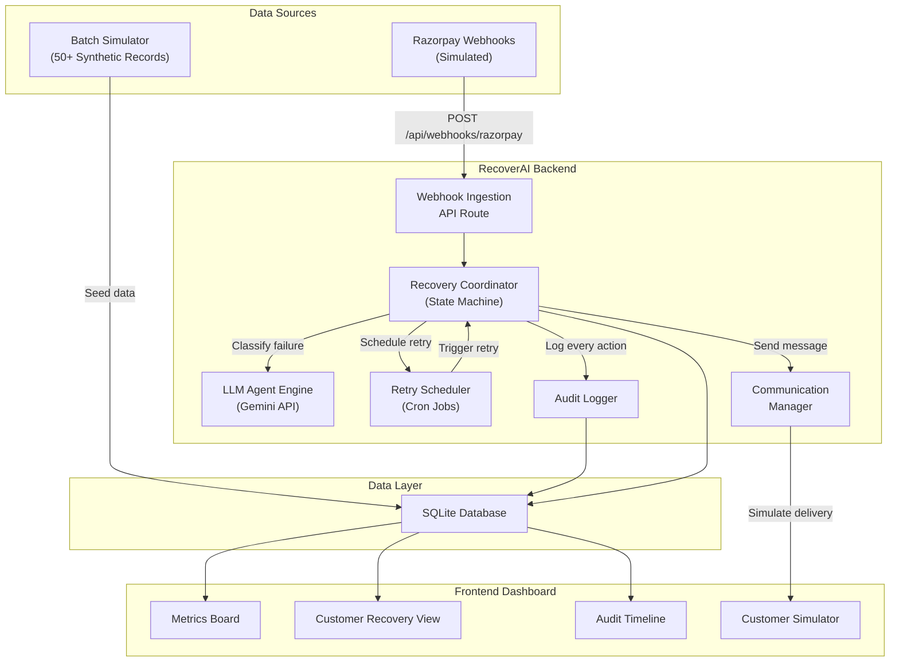
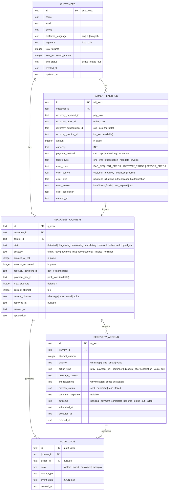
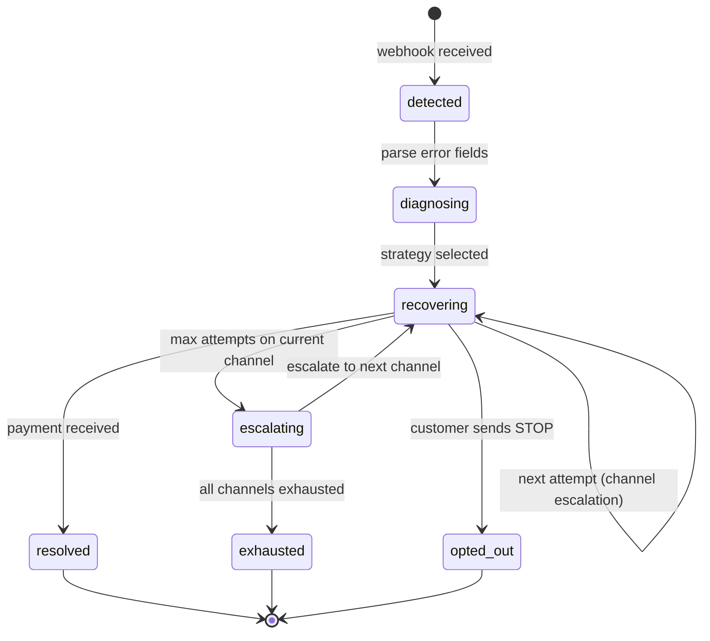

# RecoverAI — Smart Revenue Recovery Agent

## Razorpay AI Buildathon 2026 · Track 3: AI Revenue Recovery

---

## Table of Contents

1. [Executive Summary](#1-executive-summary)
2. [Problem Statement](#2-problem-statement)
3. [Solution Overview](#3-solution-overview)
4. [System Architecture](#4-system-architecture)
5. [Database Schema Design](#5-database-schema-design)
6. [Recovery Workflow Engine](#6-recovery-workflow-engine)
7. [Razorpay API Integration](#7-razorpay-api-integration)
8. [AI / LLM Integration](#8-ai--llm-integration)
9. [Compliance Framework](#9-compliance-framework)
10. [Metrics & Evaluation](#10-metrics--evaluation)
11. [Tech Stack](#11-tech-stack)
12. [Project Structure](#12-project-structure)
13. [Testing Strategy](#13-testing-strategy)
14. [References](#14-references)

---

## 1. Executive Summary

**RecoverAI** is an intelligent revenue recovery agent that detects payment failures, diagnoses root causes, selects the optimal intervention strategy, and executes bounded recovery workflows — from failed subscription mandates and checkout abandonments to overdue B2B invoices.

Unlike existing solutions that treat retry logic and customer outreach as separate, siloed systems, RecoverAI unifies them into a single autonomous agent loop with:

- **Measured money recovered** across a batch of 50+ synthetic records
- **Compliant escalation** across WhatsApp, SMS, and voice channels
- **Stopping rules** that halt outreach on opt-out, payment success, or attempt exhaustion
- **A complete audit trail** of every decision, message, and state transition

### Why This Track

Track 3 asks builders to _"find revenue that's slipping away and win it back."_ The bar is explicit:

> _"Don't just identify the problem. Show measured money recovered across a batch, with compliant escalation, stopping rules, and an audit trail."_

RecoverAI is purpose-built to clear this bar.

---

## 2. Problem Statement

### 2.1 The Revenue Leakage Crisis

Revenue loss in Indian digital commerce is not a single event — it is a cascade of degradations across payment rails, subscription cycles, checkout flows, and receivable pipelines.

#### Payment Failure Rates (India 2024–2026)

| Payment Method | Success Rate | Failure Rate | Daily Failed Txns (est.) |
| :--- | :--- | :--- | :--- |
| UPI | 92% – 99.2% | 0.8% – 8% | 3.8M – 7.6M |
| Domestic Cards | 85% – 90% | 10% – 15% | — |
| Netbanking | 90% – 95% | 5% – 10% | — |
| International Cards | 70% – 80% | 20% – 30% | — |

> **Key Insight:** While gateway dashboards report blended success rates of 92–96%, true raw merchant attempt success rates often hover around **68%–74%** when accounting for abandoned attempts, timeouts, and uncaptured intents.

#### Common Failure Reasons

| Category | Examples |
| :--- | :--- |
| **Technical Declines** | CBS downtime, NPCI switch timeout, ISP packet loss |
| **Business Declines** | Insufficient funds, incorrect UPI PIN, daily limit exceeded |
| **Mandate/Compliance** | Missing pre-debit notification, expired standing instruction, AFA threshold breach (>₹15,000) |

### 2.2 Checkout Abandonment

- **Average cart abandonment rate (India):** 70%–80%
- **Mobile abandonment:** 80.02% (vs 66.41% desktop)
- **Annual revenue lost globally:** >$18 Billion
- **Top driver:** Unexpected costs at payment step (48% of drop-offs)

### 2.3 Involuntary Subscription Churn

Involuntary churn — where paying subscribers lose access due to payment failures rather than intentional cancellation — accounts for **20%–40% of total churn** in subscription businesses.

- **Unmitigated payment failures** cause 9%–12% loss of Monthly Recurring Revenue (MRR)
- **Recurring card failure rate:** 10%–14% baseline
- **Median monthly involuntary churn:** 0.86%–1.25% of active base

### 2.4 B2B Receivables

- **₹7.34–8.1 lakh crore** (~$90B–$100B) locked in delayed payments across the Indian economy
- **Average DSO (SMEs):** 73 days (actual settlement: 90–120 days)
- **63% of B2B invoices** are paid late
- **7%+ of invoice value** ultimately written off as bad debt

### 2.5 Gaps in Existing Solutions

| Solution | Key Limitation |
| :--- | :--- |
| **Razorpay Smart Retries** | Cannot failover recurring mandates across gateways; no conversational WhatsApp dunning |
| **Stripe Smart Retries** | Black-box ML; no native WhatsApp/SMS; limited India presence |
| **Chargebee Receivables** | Expensive ($299–$2,999/mo); no native UPI deep-link dunning |
| **Recurly / Paddle** | Email-centric; near-zero reach via Indian channels |

**Universal gaps across all tools:**
1. Gateway retries isolated from ERP/accounting systems
2. Global tools rely on email (15–25% open rate) vs WhatsApp (90–98% open rate in India)
3. No dynamic alternative payment method routing (e.g., failed card → instant UPI payment link via WhatsApp)

---

## 3. Solution Overview

RecoverAI is a **full-stack autonomous agent** that closes the loop from failure detection to money recovery.

### 3.1 Core Capabilities

```
┌─────────────────────────────────────────────────────────────┐
│                      RecoverAI Agent                        │
├─────────────────────────────────────────────────────────────┤
│                                                             │
│  1. DETECT    → Ingest payment.failed / subscription.pending│
│                 webhooks and checkout drop-off events        │
│                                                             │
│  2. DIAGNOSE  → Classify failure reason using Razorpay's    │
│                 error_source / error_step / error_reason     │
│                 fields + LLM-powered contextual analysis     │
│                                                             │
│  3. DECIDE    → Select recovery strategy:                   │
│                 • Smart retry (transient/gateway errors)     │
│                 • Payment link dispatch (customer declines)  │
│                 • Conversational outreach (mandate failures)  │
│                 • Invoice reminder cadence (B2B overdue)     │
│                                                             │
│  4. EXECUTE   → Run bounded multi-channel recovery:         │
│                 WhatsApp → SMS → Voice (simulated)           │
│                 with stopping rules and escalation logic     │
│                                                             │
│  5. MEASURE   → Track recovered ₹, recovery %, attempt      │
│                 counts, channel effectiveness, and generate  │
│                 full audit trail per customer                │
│                                                             │
└─────────────────────────────────────────────────────────────┘
```

### 3.2 Recovery Scenarios Covered

| Scenario | Detection Trigger | Recovery Action |
| :--- | :--- | :--- |
| **Failed one-time payment** | `payment.failed` webhook | Classify error → generate payment link → WhatsApp/SMS dispatch |
| **Subscription charge failure** | `subscription.pending` webhook | Smart retry schedule + dunning message sequence |
| **Subscription halted** | `subscription.halted` webhook | Final recovery link + plan downgrade offer |
| **Checkout abandonment** | `order.paid` not received within threshold | Personalized reminder with cart contents + discount incentive |
| **Overdue B2B invoice** | Invoice `expire_by` approaching / passed | Escalating reminder cadence via Invoice notify API |

---

## 4. System Architecture

### 4.1 High-Level Architecture



### 4.2 Component Breakdown

#### 4.2.1 Webhook Ingestion Layer
- **Endpoint:** `POST /api/webhooks/razorpay`
- Validates `x-razorpay-signature` via HMAC-SHA256
- Parses event type and routes to Recovery Coordinator
- Idempotent processing using `event_id` deduplication

#### 4.2.2 Recovery Coordinator (State Machine)
- Central orchestrator that manages customer recovery journeys
- Maintains per-customer state: `detected → diagnosing → recovering → escalating → resolved | exhausted | opted_out`
- Enforces stopping rules and attempt limits
- Delegates to LLM for strategy selection and message generation

#### 4.2.3 LLM Agent Engine
- Uses Google Gemini API for:
  - Failure root-cause classification when Razorpay error fields are ambiguous
  - Generating personalized, empathetic recovery messages (English + Hinglish)
  - Selecting optimal recovery strategy based on customer profile and failure history
  - Conversational responses when simulated customers reply

#### 4.2.4 Retry Scheduler
- Time-based retry logic for transient failures
- Configurable cadence: attempt at T+1h, T+24h, T+72h (aligned with Razorpay's own retry windows)
- Respects RBI-mandated contact hours (8 AM – 7 PM IST)

#### 4.2.5 Communication Manager
- Orchestrates multi-channel message dispatch (simulated)
- Channel priority: WhatsApp (90–98% open rate) → SMS (28–40%) → Email (15–25%)
- Generates Razorpay Payment Links via API for each recovery attempt
- Tracks delivery status and customer responses

#### 4.2.6 Audit Logger
- Immutable, append-only log of every system event
- Records: timestamp, actor (system/customer), action, payload, outcome
- Powers the timeline view in the dashboard

---

## 5. Database Schema Design

### 5.1 Entity Relationship Diagram



### 5.2 Design Decisions

| Decision | Rationale |
| :--- | :--- |
| **SQLite** | Zero-config, single-file DB. Judges can `git clone` + `npm run dev` with no external dependencies. |
| **Amounts in paise** | Razorpay API convention. ₹4,999.00 = `499900` paise. Avoids floating-point issues. |
| **Append-only audit logs** | Immutability is critical for the buildathon's "audit trail" requirement. No `UPDATE` or `DELETE` on this table. |
| **Separate `recovery_journeys` and `recovery_actions`** | A journey is the lifecycle; actions are individual attempts within it. This enables per-attempt metrics and channel comparison. |
| **`llm_reasoning` field** | Captures the agent's chain-of-thought for each decision — directly addresses the "explainable" bar. |

---

## 6. Recovery Workflow Engine

### 6.1 State Machine



### 6.2 Strategy Selection Logic

The agent classifies failures into four buckets and selects a strategy:

```
INPUT: error_source, error_step, error_reason, failure_type, customer_segment
OUTPUT: strategy, initial_channel, retry_cadence

RULES:
┌─────────────────────────────────────────────────────────────────────────┐
│ IF error_source = "gateway" OR error_reason = "gateway_technical_error" │
│ THEN strategy = "smart_retry"                                          │
│      → Schedule automated retry at T+1h, T+24h, T+72h                 │
│      → No customer-facing outreach until retry #2 fails                │
├─────────────────────────────────────────────────────────────────────────┤
│ IF error_source = "customer" AND error_reason IN                       │
│    ("insufficient_funds", "authentication_failed", "payment_cancelled")│
│ THEN strategy = "payment_link"                                         │
│      → Generate Razorpay Payment Link                                  │
│      → Dispatch via WhatsApp with empathetic LLM-generated message     │
│      → Escalate to SMS at attempt #2, voice at attempt #3              │
├─────────────────────────────────────────────────────────────────────────┤
│ IF failure_type = "subscription" AND error_reason = "card_expired"     │
│ THEN strategy = "conversational"                                       │
│      → WhatsApp message explaining card expiry + link to update card   │
│      → Offer plan downgrade if no response within 48h                  │
├─────────────────────────────────────────────────────────────────────────┤
│ IF failure_type = "invoice" AND customer_segment = "b2b"              │
│ THEN strategy = "invoice_reminder"                                     │
│      → Razorpay Invoice notify API at Day 1, Day 7, Day 14            │
│      → Escalate to phone call simulation at Day 21                     │
└─────────────────────────────────────────────────────────────────────────┘
```

### 6.3 Stopping Rules

The agent **immediately halts** outreach when any of these conditions are met:

| Rule | Trigger | Action |
| :--- | :--- | :--- |
| **Payment Success** | `payment_link.paid` or `subscription.charged` webhook | Mark journey `resolved`, log recovered amount |
| **Customer Opt-Out** | Customer simulator sends "STOP", "unsubscribe", or equivalent | Mark journey `opted_out`, set `dnd_status = opted_out` on customer |
| **Attempt Exhaustion** | `current_attempt >= max_attempts` (default: 3) across all channels | Mark journey `exhausted` |
| **Contact Hours Violation** | Current time outside 8:00 AM – 7:00 PM IST | Defer action to next valid window |
| **DND Customer** | Customer `dnd_status = opted_out` | Skip all outreach, log skip reason |

### 6.4 Channel Escalation Matrix

| Attempt | Channel | Justification |
| :--- | :--- | :--- |
| 1 | **WhatsApp** | 90–98% open rate, 20–60% CTR, rich interactive buttons |
| 2 | **SMS** | Universal reach (no internet needed), bypasses DND for service-implicit messages |
| 3 | **Voice (simulated)** | Highest urgency signal, Hinglish conversational recovery |

---

## 7. Razorpay API Integration

### 7.1 APIs Used

| API | Purpose in RecoverAI | Test Mode Behavior |
| :--- | :--- | :--- |
| **Payment Links** (`POST /v1/payment_links`) | Generate dynamic recovery links with customer details, expiry, and callbacks | Creates real link objects; payments simulated via test checkout |
| **Payment Links Notify** (`POST /v1/payment_links/{id}/notify_by/{medium}`) | Trigger SMS/email/WhatsApp notification for a link | Simulated delivery in test mode |
| **Invoices** (`POST /v1/invoices`) | Create B2B invoices with line items and tax | Full functionality in test mode |
| **Invoice Notify** (`POST /v1/invoices/{id}/notify`) | Send payment reminders | Simulated in test mode |
| **Subscriptions** (`GET /v1/subscriptions/{id}`) | Fetch subscription state (`active`, `pending`, `halted`) | Full functionality in test mode |
| **Payments** (`GET /v1/payments/{id}`) | Fetch payment details including error fields | Full functionality in test mode |

### 7.2 Webhook Events Consumed

| Event | RecoverAI Response |
| :--- | :--- |
| `payment.failed` | Create `PAYMENT_FAILURE` record → trigger Recovery Coordinator |
| `subscription.pending` | Subscription charge failed → initiate dunning sequence |
| `subscription.halted` | All retries exhausted → final recovery attempt with downgrade offer |
| `subscription.charged` | Recovery success → mark journey `resolved` |
| `payment_link.paid` | Payment link used → mark journey `resolved`, record recovered amount |
| `payment_link.expired` | Link expired → escalate to next channel |
| `invoice.paid` | B2B invoice settled → mark journey `resolved` |
| `invoice.expired` | Invoice expired → escalate reminder cadence |

### 7.3 Webhook Payload Processing

The `payment.failed` webhook provides four critical diagnostic fields:

```
error_source  →  WHO caused the failure (customer | gateway | business | internal)
error_step    →  WHERE it failed (initiation | authentication | authorization)
error_code    →  WHAT category (BAD_REQUEST_ERROR | GATEWAY_ERROR | SERVER_ERROR)
error_reason  →  WHY specifically (insufficient_funds | card_expired | ...)
```

RecoverAI maps these four dimensions into its strategy selection matrix (Section 6.2).

#### Example `payment.failed` Payload

```json
{
  "entity": "event",
  "account_id": "acc_XXXXXXXXXXXXXX",
  "event": "payment.failed",
  "contains": ["payment"],
  "payload": {
    "payment": {
      "entity": {
        "id": "pay_K5kLmnOPQR1234",
        "amount": 499900,
        "currency": "INR",
        "status": "failed",
        "order_id": "order_K5kJ1234567890",
        "method": "card",
        "email": "customer@example.com",
        "contact": "+919876543210",
        "error_code": "BAD_REQUEST_ERROR",
        "error_description": "Payment was declined by the bank due to insufficient funds.",
        "error_source": "customer",
        "error_step": "payment_authorization",
        "error_reason": "insufficient_funds"
      }
    }
  }
}
```

### 7.4 Payment Link Creation for Recovery

```json
{
  "amount": 499900,
  "currency": "INR",
  "accept_partial": false,
  "reference_id": "RECOV_SUB_99812_202608",
  "description": "Payment recovery for subscription renewal",
  "customer": {
    "name": "Jane Doe",
    "email": "jane.doe@example.com",
    "contact": "+919876543210"
  },
  "notify": { "sms": true, "email": true, "whatsapp": true },
  "reminder_enable": true,
  "notes": {
    "failed_payment_id": "pay_K5kLmnOPQR1234",
    "subscription_id": "sub_00000000000001",
    "recovery_campaign": "recoverai_v1"
  },
  "callback_url": "https://yourapp.com/api/recovery/callback",
  "callback_method": "get",
  "expire_by": 1787476341
}
```

### 7.5 Test Mode Simulation

#### Test Cards for Failure Simulation

| Card Number | Scenario | `error_reason` |
| :--- | :--- | :--- |
| `4111 1111 1111 1111` (future expiry) | Success | — |
| `4000 0000 0000 0002` | Card Declined | `card_declined` |
| `4000 0000 0000 9995` | Insufficient Funds | `insufficient_funds` |
| `4111 1111 1111 1111` (past expiry) | Card Expired | `card_expired` |
| `4000 0000 0000 0004` | Gateway Error | `gateway_technical_error` |

#### Test UPI VPAs

| VPA | Outcome |
| :--- | :--- |
| `success@razorpay` | Instant success |
| `failure@razorpay` | Payment failed |
| `pending@razorpay` | Pending state (timeout simulation) |

### 7.6 Authentication

All API calls use HTTP Basic Auth:
```
Authorization: Basic base64(rzp_test_KEY_ID:rzp_test_KEY_SECRET)
```

Webhook signature verification:
```typescript
import crypto from 'crypto';

function verifyWebhookSignature(
  body: string,          // raw request body
  signature: string,     // x-razorpay-signature header
  secret: string         // webhook secret from Razorpay dashboard
): boolean {
  const expected = crypto
    .createHmac('sha256', secret)
    .update(body)
    .digest('hex');
  return expected === signature;
}
```

### 7.7 Subscription State Lifecycle

```
[ created ]
     │ (auth payment)
     ▼
[ authenticated ] ──► [ active ]
                          │
                   (charge failure)
                          │
                          ▼
                    [ pending ] ◄──── (Smart Retries 1, 2, 3...)
                     │        │
      (retry success)│        │ (all retries exhausted)
                     │        ▼
                     └───► [ halted ] ──► [ cancelled ]
```

---

## 8. AI / LLM Integration

### 8.1 LLM Provider

**Google Gemini API** (via `@google/generative-ai` SDK)

**Model:** `gemini-2.5-flash` — optimized for speed and cost while maintaining strong reasoning for classification and message generation tasks.

### 8.2 LLM Use Cases

#### Use Case 1: Failure Root-Cause Classification

When Razorpay's error fields are ambiguous (e.g., `error_code: BAD_REQUEST_ERROR` with vague `error_description`), the LLM provides deeper classification:

```
SYSTEM PROMPT:
You are a payment failure analyst for an Indian fintech platform.
Given the error details from a failed payment, classify the failure into
one of these categories:
- TRANSIENT_GATEWAY: Temporary bank/gateway issue. Recommend automated retry.
- CUSTOMER_FUNDS: Customer lacks funds. Recommend payment link with empathetic message.
- CUSTOMER_AUTH: Customer failed authentication (OTP/PIN). Recommend retry with guidance.
- CARD_LIFECYCLE: Card expired/blocked. Recommend card update flow.
- MANDATE_ISSUE: Recurring mandate revoked/inactive. Recommend re-authorization.
- PERMANENT_DECLINE: Issuer permanently declined. Recommend alternative payment method.

Respond with JSON: { "category": "...", "confidence": 0.0-1.0, "reasoning": "..." }
```

#### Use Case 2: Personalized Recovery Message Generation

```
SYSTEM PROMPT:
You are a friendly, empathetic payment recovery assistant for Indian customers.
Generate a short recovery message (max 160 chars for SMS, max 300 chars for WhatsApp).
Language: {customer.preferred_language} (English, Hindi, or Hinglish).
Tone: Helpful, not threatening. Never guilt-trip.
Include: The payment link URL and a clear call-to-action.
Context: {failure_reason}, {amount}, {product_description}

RULES:
- Never reveal internal error codes to the customer
- Never mention "debt" or "collection"
- Always include a way to opt out ("Reply STOP to unsubscribe")
- If offering a discount, cap at 10% and note it in the audit log
```

#### Use Case 3: Conversational Recovery (Customer Simulator Interaction)

When the simulated customer replies to the agent, the LLM generates contextual responses:

```
SYSTEM PROMPT:
You are RecoverAI, a payment recovery assistant. The customer has replied
to your recovery message. Respond helpfully within these constraints:
- If they say they'll pay later: acknowledge, schedule a reminder, and note in audit log
- If they report a problem: offer alternative payment method (UPI link if card failed)
- If they say STOP/unsubscribe: immediately confirm opt-out and end conversation
- If they ask about the charge: explain the original purchase/subscription clearly
- Never make promises about refunds or credits you cannot fulfill
- Max 2 back-and-forth exchanges before offering human escalation
```

### 8.3 Structured Output

All LLM calls use **JSON mode** with defined schemas to ensure deterministic parsing:

```typescript
const result = await model.generateContent({
  contents: [{ role: 'user', parts: [{ text: prompt }] }],
  generationConfig: {
    responseMimeType: 'application/json',
    responseSchema: {
      type: 'object',
      properties: {
        category: { type: 'string' },
        confidence: { type: 'number' },
        reasoning: { type: 'string' },
        recommended_message: { type: 'string' },
        recommended_channel: { type: 'string' }
      },
      required: ['category', 'confidence', 'reasoning']
    }
  }
});
```

### 8.4 LLM Guardrails

| Guardrail | Implementation |
| :--- | :--- |
| **No hallucinated amounts** | Payment amounts are injected from DB, never generated by LLM |
| **No unauthorized discounts** | Discount offers capped at 10%, logged in `llm_reasoning` field |
| **No sensitive data in prompts** | Only failure reason, amount, and language sent to LLM — no PII |
| **Deterministic fallback** | If LLM response fails schema validation, use template-based fallback messages |
| **Rate limiting** | Max 60 LLM calls/minute to stay within API quotas |

---

## 9. Compliance Framework

### 9.1 RBI Guidelines

| Requirement | RecoverAI Implementation |
| :--- | :--- |
| **Contact hours: 8 AM – 7 PM IST** | Scheduler enforces time-window gating. Actions outside window are deferred to next valid slot. |
| **No harassment** | Max 3 attempts per customer. Empathetic tone enforced via LLM system prompt. No threatening language. |
| **Pre-debit notification (24h)** | For subscription retries, pre-debit alert is logged before any scheduled retry attempt. |
| **₹15,000 AFA threshold** | Transactions above ₹15,000 are flagged and require manual customer authentication — agent provides a checkout link rather than auto-debit. |

### 9.2 TRAI DLT Compliance

| Requirement | RecoverAI Implementation |
| :--- | :--- |
| **DLT registration** | SMS messages use registered templates with `{#var#}` placeholders (simulated in demo) |
| **Message classification** | Payment reminders classified as **Service Implicit** (delivers 24/7, bypasses DND) |
| **No promotional content in service messages** | Discount offers sent as separate promotional template, filtered for DND |

### 9.3 DPDPA (Data Protection)

| Requirement | RecoverAI Implementation |
| :--- | :--- |
| **Consent for outreach** | Assumed via existing merchant-customer relationship (transactional context) |
| **Opt-out mechanism** | "Reply STOP" in every message; instant `opted_out` status transition |
| **Data minimization** | Only failure reason, amount, and language sent to LLM — no card numbers, bank details, or addresses |

---

## 10. Metrics & Evaluation

### 10.1 Primary Dashboard Metrics

| Metric | Definition | Target |
| :--- | :--- | :--- |
| **Total Revenue at Risk** | Sum of `amount_at_risk` across all active journeys | — |
| **Total Revenue Recovered** | Sum of `amount_recovered` for `resolved` journeys | — |
| **Recovery Rate** | `recovered / at_risk × 100` | >50% (industry median: 47.6%) |
| **Average Recovery Time** | Mean(`resolved_at - created_at`) for resolved journeys | <48 hours |
| **Attempt Efficiency** | Recoveries per total attempts | Higher = better targeting |
| **Opt-Out Rate** | `opted_out / total_journeys × 100` | <5% (non-aggressive approach) |

### 10.2 Channel Comparison Metrics

| Metric | WhatsApp | SMS | Voice |
| :--- | :--- | :--- | :--- |
| **Delivery Rate** | Simulated 95% | Simulated 98% | Simulated 90% |
| **Open/Engagement Rate** | Simulated 90% | Simulated 35% | Simulated 80% |
| **Recovery Conversion** | Tracked per channel | Tracked per channel | Tracked per channel |
| **Cost per Recovery** | ₹0.90/msg | ₹0.15/msg | ₹2.50/call |

### 10.3 Batch Evaluation

The demo seeds **50+ synthetic failure records** spanning:

- 15 one-time payment failures (card + UPI mix)
- 15 subscription charge failures (various error reasons)
- 10 checkout abandonment events
- 10 overdue B2B invoices

After running the agent, the dashboard displays:
- Total batch value at risk
- Total recovered
- Per-scenario breakdown
- Per-channel breakdown
- Exception list (unrecoverable failures with reasons)

> This directly satisfies the Track 3 bar: _"Throughput plus measured accuracy plus an honest exception list."_

---

## 11. Tech Stack

| Layer | Technology | Justification |
| :--- | :--- | :--- |
| **Framework** | Next.js 15 (App Router, TypeScript) | Full-stack in one repo; server actions for agent logic; React for dashboard |
| **Styling** | Tailwind CSS + shadcn/ui | Production-quality UI components with minimal effort |
| **Database** | SQLite via `better-sqlite3` | Zero-config, single-file, portable |
| **ORM** | Drizzle ORM | Type-safe SQL queries, lightweight, SQLite-native |
| **AI/LLM** | Google Gemini API (`@google/generative-ai`) | Fast, cost-effective, JSON mode support, generous free tier |
| **Charts** | Recharts | React-native charting for metrics dashboard |
| **Icons** | Lucide React | Clean, consistent icon set |
| **ID Generation** | `nanoid` | Compact, URL-safe unique IDs for all entities |
| **Date/Time** | `date-fns` | Lightweight date manipulation and formatting |

---

## 12. Project Structure

```
recover-ai/
├── src/
│   ├── app/                          # Next.js App Router
│   │   ├── layout.tsx                # Root layout with providers
│   │   ├── page.tsx                  # Dashboard home (metrics overview)
│   │   ├── api/
│   │   │   ├── webhooks/
│   │   │   │   └── razorpay/
│   │   │   │       └── route.ts      # POST: Webhook ingestion endpoint
│   │   │   ├── recovery/
│   │   │   │   ├── trigger/
│   │   │   │   │   └── route.ts      # POST: Manually trigger recovery
│   │   │   │   └── respond/
│   │   │   │       └── route.ts      # POST: Handle simulated customer response
│   │   │   ├── simulator/
│   │   │   │   ├── seed/
│   │   │   │   │   └── route.ts      # POST: Seed 50+ synthetic failure records
│   │   │   │   ├── pay/
│   │   │   │   │   └── route.ts      # POST: Simulate customer paying
│   │   │   │   └── reply/
│   │   │   │       └── route.ts      # POST: Simulate customer replying
│   │   │   └── metrics/
│   │   │       └── route.ts          # GET: Fetch aggregated metrics
│   │   ├── customers/
│   │   │   └── [id]/
│   │   │       └── page.tsx          # Customer detail + audit timeline
│   │   └── simulator/
│   │       └── page.tsx              # Customer simulator UI
│   │
│   ├── lib/
│   │   ├── db/
│   │   │   ├── index.ts              # SQLite connection + Drizzle instance
│   │   │   ├── schema.ts             # Drizzle schema definitions
│   │   │   ├── seed.ts               # Synthetic data generation
│   │   │   └── migrations/           # Drizzle migration files
│   │   │
│   │   ├── recovery/
│   │   │   ├── coordinator.ts        # Core state machine + orchestration
│   │   │   ├── classifier.ts         # Failure classification logic
│   │   │   ├── strategies.ts         # Strategy selection rules
│   │   │   └── scheduler.ts          # Retry timing + contact-hours
│   │   │
│   │   ├── ai/
│   │   │   ├── gemini.ts             # Gemini client initialization
│   │   │   ├── prompts.ts            # All system prompts and templates
│   │   │   ├── classifier.ts         # LLM-powered failure classification
│   │   │   └── messenger.ts          # LLM-powered message generation
│   │   │
│   │   ├── razorpay/
│   │   │   ├── client.ts             # Razorpay API client (test mode)
│   │   │   ├── webhooks.ts           # Webhook signature verification
│   │   │   ├── payment-links.ts      # Payment Link creation + notification
│   │   │   └── types.ts              # TypeScript types for Razorpay entities
│   │   │
│   │   ├── communication/
│   │   │   ├── manager.ts            # Channel dispatch orchestration
│   │   │   ├── whatsapp.ts           # WhatsApp simulator
│   │   │   ├── sms.ts                # SMS simulator
│   │   │   └── voice.ts              # Voice call simulator
│   │   │
│   │   └── utils/
│   │       ├── audit.ts              # Audit log writer
│   │       ├── ids.ts                # ID generation helpers
│   │       └── time.ts               # IST time helpers
│   │
│   └── components/
│       ├── ui/                       # shadcn/ui components
│       ├── dashboard/
│       │   ├── MetricsCards.tsx       # Revenue at risk, recovered, rate
│       │   ├── RecoveryChart.tsx      # Recovery over time chart
│       │   ├── ChannelComparison.tsx  # Channel effectiveness comparison
│       │   └── FailureBreakdown.tsx   # Failure type distribution
│       ├── customers/
│       │   ├── CustomerTable.tsx      # Sortable customer recovery list
│       │   ├── AuditTimeline.tsx      # Visual timeline of journey
│       │   └── JourneyStatusBadge.tsx # Status indicator component
│       └── simulator/
│           ├── CustomerSimulator.tsx  # Interactive customer response UI
│           ├── MessageBubble.tsx      # Chat-style message display
│           └── BatchControls.tsx      # Batch seed + run controls
│
├── drizzle.config.ts                 # Drizzle ORM configuration
├── tailwind.config.ts                # Tailwind configuration
├── next.config.ts                    # Next.js configuration
├── package.json
├── tsconfig.json
├── .env.example                      # Required env vars template
├── README.md                         # Quick start guide
└── docs/
    └── PROJECT_DOCUMENTATION.md      # This document
```

---

## 13. Testing Strategy

### 13.1 Synthetic Data Batch

The seed script generates **50+ records** with controlled distribution:

| Failure Type | Count | Error Reasons Covered |
| :--- | :--- | :--- |
| One-time card failure | 8 | `insufficient_funds`, `card_expired`, `card_declined`, `authentication_failed` |
| One-time UPI failure | 7 | `payment_cancelled`, `gateway_technical_error`, `bank_account_invalid` |
| Subscription charge failure | 8 | `insufficient_funds`, `card_expired`, `mandate_inactive` |
| Subscription mandate failure | 7 | `mandate_inactive`, `authentication_failed` |
| Checkout abandonment | 10 | Order created, no `payment.captured` within 30 min |
| B2B overdue invoice | 10 | Invoice `expire_by` passed without `invoice.paid` |

### 13.2 Simulation Scenarios

| Scenario | Expected Outcome |
| :--- | :--- |
| Gateway error → Smart retry | Auto-retry succeeds on attempt #2, journey `resolved` |
| Insufficient funds → Payment link | Customer clicks link (simulated), journey `resolved` |
| Card expired → Card update flow | WhatsApp message with update link, customer updates, journey `resolved` |
| Customer sends "STOP" | Journey immediately marked `opted_out`, no further messages |
| All 3 attempts fail | Journey marked `exhausted`, appears in exception list |
| Contact outside 8AM–7PM | Action deferred, audit log records deferral reason |
| B2B invoice overdue | 3-stage reminder escalation, partial payment tracking |

### 13.3 Demo Flow for Judges

1. **Seed the batch** → Click "Seed 50+ Failures" on the simulator page
2. **Run the agent** → Click "Start Recovery" to process all failures
3. **Watch the dashboard** → Metrics update in real-time as recoveries happen
4. **Play as a customer** → Switch to simulator, reply to agent messages, test opt-out
5. **Review the audit trail** → Click any customer to see the full decision timeline
6. **Check the exception list** → View unrecoverable failures with honest reasons

---

## 14. References

### Market Data
- NPCI UPI Technical Decline Monitoring Reports (2024–2026)
- Baymard Institute Cart Abandonment Statistics (2025)
- Atradius Payment Practices Barometer — India (2025/2026)
- GAME-FISME-C2FO Report on MSME Delayed Payments
- Economic Survey of India 2025–26
- Recordent SME Receivables Report 2026

### Razorpay Documentation
- [Razorpay Payment Gateway API](https://razorpay.com/docs/api/payments/)
- [Razorpay Webhooks](https://razorpay.com/docs/webhooks/)
- [Razorpay Subscriptions API](https://razorpay.com/docs/api/subscriptions/)
- [Razorpay Payment Links API](https://razorpay.com/docs/api/payment-links/)
- [Razorpay Invoice API](https://razorpay.com/docs/api/invoices/)
- [Razorpay Test Mode Guide](https://razorpay.com/docs/payments/test-mode/)

### Regulatory
- RBI Fair Practices Code for Debt Collection
- TRAI DLT Registration Framework (2024 Update)
- Digital Personal Data Protection Act (DPDPA), 2023
- RBI Framework for Recurring Online Transactions (e-Mandate)

### Industry Benchmarks
- Chargebee: 50–70% failed payment recovery rate
- Recurly Intelligent Retries: 53% → 71% recovery improvement
- Stripe Smart Retries: 25–55% recovery rate
- WhatsApp Business: 90–98% open rate (India)
- Median industry recovery rate: 47.6%
- Top-quartile recovery rate: 70–85%
