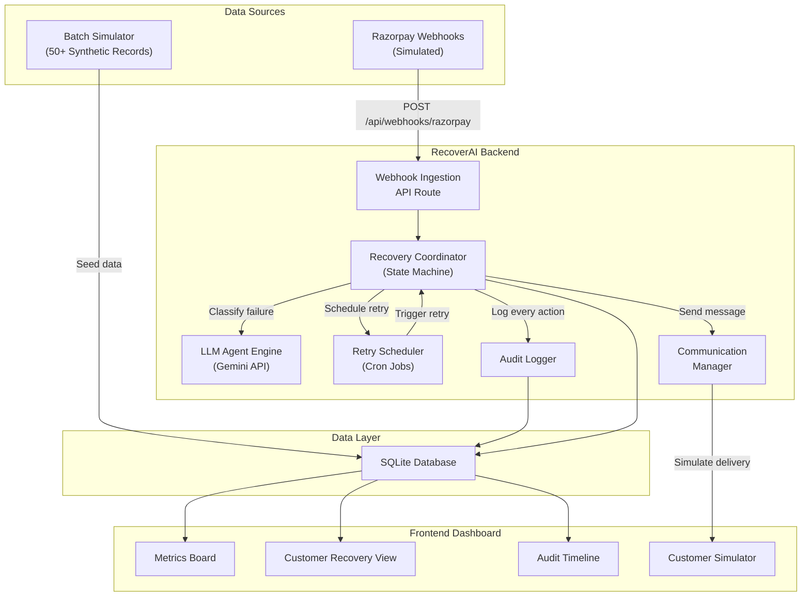
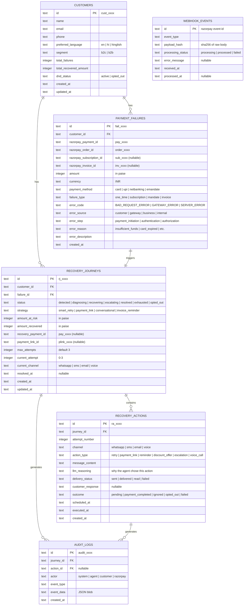
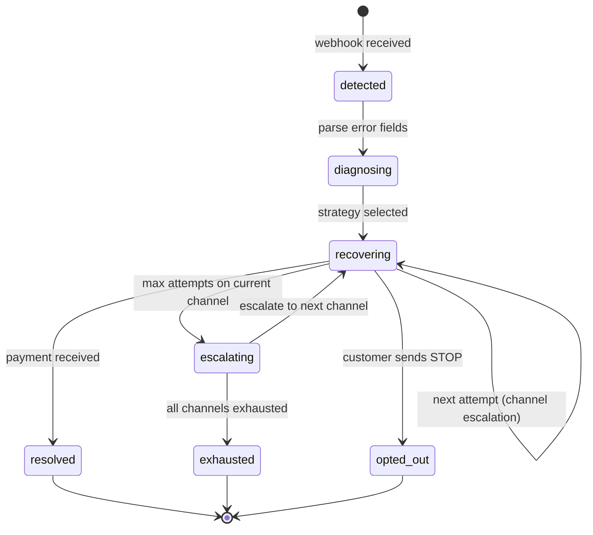

# RecoverAI — Smart Revenue Recovery Agent

## Razorpay AI Buildathon 2026 · Track 3: AI Revenue Recovery

---

## Table of Contents

1. [Executive Summary](#1-executive-summary)
2. [Problem Statement](#2-problem-statement)
3. [Solution Overview](#3-solution-overview)
4. [System Architecture](#4-system-architecture)
5. [Database Schema Design](#5-database-schema-design)
6. [Recovery Workflow Engine](#6-recovery-workflow-engine)
7. [Razorpay API Integration](#7-razorpay-api-integration)
8. [AI / LLM Integration](#8-ai--llm-integration)
9. [Compliance Framework](#9-compliance-framework)
10. [Metrics & Evaluation](#10-metrics--evaluation)
11. [Tech Stack](#11-tech-stack)
12. [Project Structure](#12-project-structure)
13. [Testing Strategy](#13-testing-strategy)
14. [References](#14-references)

---

## 1. Executive Summary

**RecoverAI** is an intelligent revenue recovery agent that detects payment failures, diagnoses root causes, selects the optimal intervention strategy, and executes bounded recovery workflows — from failed subscription mandates and checkout abandonments to overdue B2B invoices.

Unlike existing solutions that treat retry logic and customer outreach as separate, siloed systems, RecoverAI unifies them into a single autonomous agent loop with:

- **Measured money recovered** across a batch of 50+ synthetic records
- **Compliant escalation** across WhatsApp, SMS, and voice channels
- **Stopping rules** that halt outreach on opt-out, payment success, or attempt exhaustion
- **A complete audit trail** of every decision, message, and state transition

### Why This Track

Track 3 asks builders to _"find revenue that's slipping away and win it back."_ The bar is explicit:

> _"Don't just identify the problem. Show measured money recovered across a batch, with compliant escalation, stopping rules, and an audit trail."_

RecoverAI is purpose-built to clear this bar.

---

## 2. Problem Statement

### 2.1 The Revenue Leakage Crisis

Revenue loss in Indian digital commerce is not a single event — it is a cascade of degradations across payment rails, subscription cycles, checkout flows, and receivable pipelines.

#### Payment Failure Rates (India 2024–2026)

| Payment Method | Success Rate | Failure Rate | Daily Failed Txns (est.) |
| :--- | :--- | :--- | :--- |
| UPI | 92% – 99.2% | 0.8% – 8% | 3.8M – 7.6M |
| Domestic Cards | 85% – 90% | 10% – 15% | — |
| Netbanking | 90% – 95% | 5% – 10% | — |
| International Cards | 70% – 80% | 20% – 30% | — |

> **Key Insight:** While gateway dashboards report blended success rates of 92–96%, true raw merchant attempt success rates often hover around **68%–74%** when accounting for abandoned attempts, timeouts, and uncaptured intents.

#### Common Failure Reasons

| Category | Examples |
| :--- | :--- |
| **Technical Declines** | CBS downtime, NPCI switch timeout, ISP packet loss |
| **Business Declines** | Insufficient funds, incorrect UPI PIN, daily limit exceeded |
| **Mandate/Compliance** | Missing pre-debit notification, expired standing instruction, AFA threshold breach (>₹15,000) |

### 2.2 Checkout Abandonment

- **Average cart abandonment rate (India):** 70%–80%
- **Mobile abandonment:** 80.02% (vs 66.41% desktop)
- **Annual revenue lost globally:** >$18 Billion
- **Top driver:** Unexpected costs at payment step (48% of drop-offs)

### 2.3 Involuntary Subscription Churn

Involuntary churn — where paying subscribers lose access due to payment failures rather than intentional cancellation — accounts for **20%–40% of total churn** in subscription businesses.

- **Unmitigated payment failures** cause 9%–12% loss of Monthly Recurring Revenue (MRR)
- **Recurring card failure rate:** 10%–14% baseline
- **Median monthly involuntary churn:** 0.86%–1.25% of active base

### 2.4 B2B Receivables

- **₹7.34–8.1 lakh crore** (~$90B–$100B) locked in delayed payments across the Indian economy
- **Average DSO (SMEs):** 73 days (actual settlement: 90–120 days)
- **63% of B2B invoices** are paid late
- **7%+ of invoice value** ultimately written off as bad debt

### 2.5 Gaps in Existing Solutions

| Solution | Key Limitation |
| :--- | :--- |
| **Razorpay Smart Retries** | Cannot failover recurring mandates across gateways; no conversational WhatsApp dunning |
| **Stripe Smart Retries** | Black-box ML; no native WhatsApp/SMS; limited India presence |
| **Chargebee Receivables** | Expensive ($299–$2,999/mo); no native UPI deep-link dunning |
| **Recurly / Paddle** | Email-centric; near-zero reach via Indian channels |

**Universal gaps across all tools:**
1. Gateway retries isolated from ERP/accounting systems
2. Global tools rely on email (15–25% open rate) vs WhatsApp (90–98% open rate in India)
3. No dynamic alternative payment method routing (e.g., failed card → instant UPI payment link via WhatsApp)

---

## 3. Solution Overview

RecoverAI is a **full-stack autonomous agent** that closes the loop from failure detection to money recovery.

### 3.1 Core Capabilities

```
┌─────────────────────────────────────────────────────────────┐
│                      RecoverAI Agent                        │
├─────────────────────────────────────────────────────────────┤
│                                                             │
│  1. DETECT    → Ingest payment.failed / subscription.pending│
│                 webhooks and checkout drop-off events        │
│                                                             │
│  2. DIAGNOSE  → Classify failure reason using Razorpay's    │
│                 error_source / error_step / error_reason     │
│                 fields + LLM-powered contextual analysis     │
│                                                             │
│  3. DECIDE    → Select recovery strategy:                   │
│                 • Smart retry (transient/gateway errors)     │
│                 • Payment link dispatch (customer declines)  │
│                 • Conversational outreach (mandate failures)  │
│                 • Invoice reminder cadence (B2B overdue)     │
│                                                             │
│  4. EXECUTE   → Run bounded multi-channel recovery:         │
│                 WhatsApp → SMS → Voice (simulated)           │
│                 with stopping rules and escalation logic     │
│                                                             │
│  5. MEASURE   → Track recovered ₹, recovery %, attempt      │
│                 counts, channel effectiveness, and generate  │
│                 full audit trail per customer                │
│                                                             │
└─────────────────────────────────────────────────────────────┘
```

### 3.2 Recovery Scenarios Covered

| Scenario | Detection Trigger | Recovery Action |
| :--- | :--- | :--- |
| **Failed one-time payment** | `payment.failed` webhook | Classify error → generate payment link → WhatsApp/SMS dispatch |
| **Subscription charge failure** | `subscription.pending` webhook | Smart retry schedule + dunning message sequence |
| **Subscription halted** | `subscription.halted` webhook | Final recovery link + plan downgrade offer |
| **Checkout abandonment** | `order.paid` not received within threshold | Personalized reminder with cart contents + discount incentive |
| **Overdue B2B invoice** | Invoice `expire_by` approaching / passed | Escalating reminder cadence via Invoice notify API |

---

## 4. System Architecture

### 4.1 High-Level Architecture



### 4.2 Component Breakdown

#### 4.2.1 Webhook Ingestion Layer
- **Endpoint:** `POST /api/webhooks/razorpay`
- Validates `x-razorpay-signature` via HMAC-SHA256
- Parses event type and routes to Recovery Coordinator
- Idempotent processing using `event_id` deduplication

#### 4.2.2 Recovery Coordinator (State Machine)
- Central orchestrator that manages customer recovery journeys
- Maintains per-customer state: `detected → diagnosing → recovering → escalating → resolved | exhausted | opted_out`
- Enforces stopping rules and attempt limits
- Delegates to LLM for strategy selection and message generation

#### 4.2.3 LLM Agent Engine
- Uses Google Gemini API for:
  - Failure root-cause classification when Razorpay error fields are ambiguous
  - Generating personalized, empathetic recovery messages (English + Hinglish)
  - Selecting optimal recovery strategy based on customer profile and failure history
  - Conversational responses when simulated customers reply

#### 4.2.4 Retry Scheduler
- Time-based retry logic for transient failures
- Configurable cadence: attempt at T+1h, T+24h, T+72h (aligned with Razorpay's own retry windows)
- Respects RBI-mandated contact hours (8 AM – 7 PM IST)

#### 4.2.5 Communication Manager
- Orchestrates multi-channel message dispatch (simulated)
- Channel priority: WhatsApp (90–98% open rate) → SMS (28–40%) → Email (15–25%)
- Generates Razorpay Payment Links via API for each recovery attempt
- Tracks delivery status and customer responses

#### 4.2.6 Audit Logger
- Immutable, append-only log of every system event
- Records: timestamp, actor (system/customer), action, payload, outcome
- Powers the timeline view in the dashboard

---

## 5. Database Schema Design

### 5.1 Entity Relationship Diagram



> **Note:** `WEBHOOK_EVENTS` is intentionally standalone with no foreign keys — it must be writable
> *before* we know which customer or journey an event belongs to, since that is the whole point of
> claiming the event ID first.

### 5.2 Design Decisions

| Decision | Rationale |
| :--- | :--- |
| **SQLite** | Zero-config, single-file DB. Judges can `git clone` + `npm run dev` with no external dependencies. |
| **Amounts in paise** | Razorpay API convention. ₹4,999.00 = `499900` paise. Avoids floating-point issues. |
| **Append-only audit logs** | Immutability is critical for the buildathon's "audit trail" requirement. No `UPDATE` or `DELETE` on this table. |
| **Separate `recovery_journeys` and `recovery_actions`** | A journey is the lifecycle; actions are individual attempts within it. This enables per-attempt metrics and channel comparison. |
| **`llm_reasoning` field** | Captures the agent's chain-of-thought for each decision — directly addresses the "explainable" bar. |
| **Dedicated `webhook_events` table** | Idempotency needs somewhere to record "I have seen this `event_id`". Razorpay retries webhooks on non-2xx, so a duplicate `payment.failed` must not create a second journey and a second round of messages to the same customer. The row is inserted with status `processing` *before* handling begins, so a retry arriving mid-processing is rejected rather than racing the original. |
| **`payload_hash` on webhook events** | Distinguishes a genuine Razorpay retry (same ID, same bytes) from an ID collision or replay attack (same ID, different bytes) — the latter is logged as a security event rather than silently ignored. |

---

## 6. Recovery Workflow Engine

### 6.1 State Machine



### 6.2 Strategy Selection Logic

The agent classifies failures into four buckets and selects a strategy:

```
INPUT: error_source, error_step, error_reason, failure_type, customer_segment
OUTPUT: strategy, initial_channel, retry_cadence

RULES:
┌─────────────────────────────────────────────────────────────────────────┐
│ IF error_source IN ("gateway", "network", "issuer_bank",               │
│                     "customer_psp", "beneficiary_bank")                │
│ THEN strategy = "smart_retry"                                          │
│      → Infrastructure failure; the customer did nothing wrong           │
│      → Schedule automated retry at T+1h, T+24h, T+72h                 │
│      → No customer-facing outreach until retry #2 fails                │
├─────────────────────────────────────────────────────────────────────────┤
│ IF error_source IN ("business", "internal")                            │
│ THEN strategy = "merchant_alert"                                       │
│      → Merchant-side misconfiguration the customer cannot fix          │
│      → Surface on the dashboard; send NO customer outreach             │
├─────────────────────────────────────────────────────────────────────────┤
│ IF error_source = "customer" AND error_reason IN                       │
│    ("insufficient_funds", "authentication_failed", "payment_cancelled")│
│ THEN strategy = "payment_link"                                         │
│      → Generate Razorpay Payment Link                                  │
│      → Dispatch via WhatsApp with empathetic LLM-generated message     │
│      → Escalate to SMS at attempt #2, voice at attempt #3              │
├─────────────────────────────────────────────────────────────────────────┤
│ IF failure_type = "subscription" AND error_reason = "card_expired"     │
│ THEN strategy = "conversational"                                       │
│      → WhatsApp message explaining card expiry + link to update card   │
│      → Offer plan downgrade if no response within 48h                  │
├─────────────────────────────────────────────────────────────────────────┤
│ IF failure_type = "invoice" AND customer_segment = "b2b"              │
│ THEN strategy = "invoice_reminder"                                     │
│      → Razorpay Invoice notify API at Day 1, Day 7, Day 14            │
│      → Escalate to phone call simulation at Day 21                     │
├─────────────────────────────────────────────────────────────────────────┤
│ ELSE (error_source not recognised)                                     │
│ THEN strategy = null                                                   │
│      → Log "unclassified_source" audit event                           │
│      → Route to exception list for human review                        │
│      → NEVER guess a strategy for an unknown source                    │
└─────────────────────────────────────────────────────────────────────────┘
```

Note the deliberate absence of a catch-all. Guessing on an unrecognised failure means messaging a
customer for a reason the agent does not understand — the exact behaviour the stopping rules exist to
prevent. An honest `unclassified` bucket is a better outcome than a confident wrong one, and it shows
up in the exception list where it can be counted.

### 6.3 Stopping Rules

The agent **immediately halts** outreach when any of these conditions are met:

| Rule | Trigger | Action |
| :--- | :--- | :--- |
| **Payment Success** | `payment_link.paid` or `subscription.charged` webhook | Mark journey `resolved`, log recovered amount |
| **Customer Opt-Out** | Customer simulator sends "STOP", "unsubscribe", or equivalent | Mark journey `opted_out`, set `dnd_status = opted_out` on customer |
| **Attempt Exhaustion** | `current_attempt >= max_attempts` (default: 3) across all channels | Mark journey `exhausted` |
| **Contact Hours Violation** | Current time outside 8:00 AM – 7:00 PM IST | Defer action to next valid window |
| **DND Customer** | Customer `dnd_status = opted_out` | Skip all outreach, log skip reason |

### 6.4 Channel Escalation Matrix

| Attempt | Channel | Justification |
| :--- | :--- | :--- |
| 1 | **WhatsApp** | 90–98% open rate, 20–60% CTR, rich interactive buttons |
| 2 | **SMS** | Universal reach (no internet needed), bypasses DND for service-implicit messages |
| 3 | **Voice (simulated)** | Highest urgency signal, Hinglish conversational recovery |

### 6.5 Virtual Clock (required for the demo to be possible at all)

There is a hard conflict between the design and the demo format that has to be solved explicitly:

- The retry cadence is **T+1h, T+24h, T+72h**.
- Contact hours are **08:00–19:00 IST**.
- The demo is **five minutes long**, and may well be recorded at midnight.

Run against the system clock, the `smart_retry` strategy can never fire inside a demo, the escalation
ladder never advances past attempt 1, and a demo recorded at 23:00 IST shows an agent that correctly
and undemonstrably refuses to do anything at all. The most defensible behaviour in the system would
read as a broken product.

**Resolution: no module reads the wall clock directly.** All time flows through a single injectable
clock in `src/lib/utils/time.ts`:

```typescript
export interface Clock {
  now(): Date;
}
```

- **Production/default:** a real clock returning system time.
- **Demo:** a virtual clock with a settable offset, driven from the simulator UI
  ("advance 1 hour", "advance 24 hours", "jump to 10:00 AM IST").
- **Tests:** a fixed clock pinned to a constant instant, so contact-hours boundary tests
  (07:59 vs 08:00 vs 19:01 IST) are deterministic rather than dependent on when CI happens to run.

Two rules make this safe:

1. **Advancing the clock is itself an audited event.** It is written to `audit_logs` as a
   `clock_advanced` entry. An evaluator scrubbing the timeline can see exactly where time was moved and
   can satisfy themselves that no recovery was fabricated by skipping a stopping rule.
2. **The clock never runs backwards during a demo**, so scheduled actions cannot be replayed twice.

This is also the mechanism that makes contact-hours enforcement *visible*: jump the clock to 21:00 IST,
watch the agent defer every queued outreach with a logged reason, jump to 09:00 the next morning, watch
it resume. That deferral is one of the strongest things the agent does, and without a virtual clock it
is invisible.

### 6.6 Detecting checkout abandonment (there is no webhook for it)

The other four scenarios are webhook-driven. Checkout abandonment is not, and cannot be: abandonment is
defined by the **absence** of an event, and absence never arrives as a callback.

Detection is therefore a **sweep**, not a subscription:

```
every N minutes (or on clock advance):
  find orders where
      status = 'created'
      AND no successful payment recorded
      AND age > ABANDONMENT_THRESHOLD (default 30 min)
      AND no recovery journey already exists
  → open a recovery journey with strategy = 'conversational'
```

Two consequences worth stating, because both are easy to get wrong:

- **The threshold is a real trade-off, not a constant to be picked arbitrarily.** Too short and the
  agent messages people who are still typing their card details — actively harmful. Too long and the
  purchase intent has evaporated. 30 minutes is the starting default and it is configurable.
- **The sweep must be idempotent.** It runs repeatedly over the same table, so the
  "no journey already exists" guard is the only thing preventing an abandoned cart from accumulating a
  fresh recovery journey on every pass.

---

## 7. Razorpay API Integration

### 7.1 APIs Used

| API | Purpose in RecoverAI | Test Mode Behavior |
| :--- | :--- | :--- |
| **Payment Links** (`POST /v1/payment_links`) | Generate dynamic recovery links with customer details, expiry, and callbacks | Creates real link objects; payments simulated via test checkout |
| **Payment Links Notify** (`POST /v1/payment_links/{id}/notify_by/{medium}`) | Trigger notification for a link. **`medium` accepts only `sms` or `email`** — WhatsApp is *not* a supported medium on this endpoint | Simulated delivery in test mode |
| **Invoices** (`POST /v1/invoices`) | Create B2B invoices with line items and tax | Full functionality in test mode |
| **Invoice Notify** (`POST /v1/invoices/{id}/notify`) | Send payment reminders | Simulated in test mode |
| **Subscriptions** (`GET /v1/subscriptions/{id}`) | Fetch subscription state (`active`, `pending`, `halted`) | Full functionality in test mode |
| **Payments** (`GET /v1/payments/{id}`) | Fetch payment details including error fields | Full functionality in test mode |

### 7.2 Webhook Events Consumed

| Event | RecoverAI Response |
| :--- | :--- |
| `payment.failed` | Create `PAYMENT_FAILURE` record → trigger Recovery Coordinator |
| `subscription.pending` | Subscription charge failed → initiate dunning sequence |
| `subscription.halted` | All retries exhausted → final recovery attempt with downgrade offer |
| `subscription.charged` | Recovery success → mark journey `resolved` |
| `payment_link.paid` | Payment link used → mark journey `resolved`, record recovered amount |
| `payment_link.expired` | Link expired → escalate to next channel |
| `invoice.paid` | B2B invoice settled → mark journey `resolved` |
| `invoice.expired` | Invoice expired → escalate reminder cadence |

### 7.3 Webhook Payload Processing

The `payment.failed` webhook provides four critical diagnostic fields:

```
error_source  →  WHO caused the failure (method-dependent, see table below)
error_step    →  WHERE it failed (initiation | authentication | authorization)
error_code    →  WHAT category (BAD_REQUEST_ERROR | GATEWAY_ERROR | SERVER_ERROR)
error_reason  →  WHY specifically (insufficient_funds | card_expired | ...)
```

#### `error_source` is method-dependent — handle the full enum

A common and costly mistake is assuming `error_source` is a flat four-value enum. It is not: the
permitted values differ by payment method, and UPI in particular carries several sources that have no
card equivalent.

| Method | Documented `error_source` values |
| :--- | :--- |
| **Cards** | `customer`, `business`, `internal`, `gateway`, `issuer_bank` |
| **UPI** | `customer`, `business`, `internal`, `customer_psp`, `gateway`, `network`, `issuer_bank`, `beneficiary_bank` |

Source: [Payment Method Error Parameters](https://razorpay.com/docs/errors/payment-error-parameters).

**Why this matters for routing.** `issuer_bank`, `network`, `customer_psp`, and `beneficiary_bank` are
all *infrastructure* failures — the customer did nothing wrong and re-contacting them is both useless
and annoying. They belong in the `smart_retry` bucket alongside `gateway`, not in the customer-outreach
bucket. A classifier that only branches on `customer | gateway | business | internal` will fall through
to its default on a large share of real UPI traffic, and in a country where UPI dominates that is not
an edge case.

The classifier must therefore:

- Treat `gateway`, `network`, `issuer_bank`, `customer_psp`, `beneficiary_bank` as **retryable
  infrastructure** sources.
- Treat `customer` as the only source that justifies immediate customer-facing outreach.
- Treat `business` and `internal` as **merchant-side** — surface to the merchant, never message the
  customer, because the customer cannot fix a merchant misconfiguration.
- **Never silently default.** An unrecognised `error_source` is logged as an explicit
  `unclassified_source` audit event and routed to the exception list for human review, rather than
  being guessed at.

RecoverAI maps these four dimensions into its strategy selection matrix (Section 6.2).

#### Example `payment.failed` Payload

```json
{
  "entity": "event",
  "account_id": "acc_XXXXXXXXXXXXXX",
  "event": "payment.failed",
  "contains": ["payment"],
  "payload": {
    "payment": {
      "entity": {
        "id": "pay_K5kLmnOPQR1234",
        "amount": 499900,
        "currency": "INR",
        "status": "failed",
        "order_id": "order_K5kJ1234567890",
        "method": "card",
        "email": "customer@example.com",
        "contact": "+919876543210",
        "error_code": "BAD_REQUEST_ERROR",
        "error_description": "Payment was declined by the bank due to insufficient funds.",
        "error_source": "customer",
        "error_step": "payment_authorization",
        "error_reason": "insufficient_funds"
      }
    }
  }
}
```

### 7.4 Payment Link Creation for Recovery

```json
{
  "amount": 499900,
  "currency": "INR",
  "accept_partial": false,
  "reference_id": "RECOV_SUB_99812_202608",
  "description": "Payment recovery for subscription renewal",
  "customer": {
    "name": "Jane Doe",
    "email": "jane.doe@example.com",
    "contact": "+919876543210"
  },
  "notify": { "sms": true, "email": true },
  "reminder_enable": true,
  "notes": {
    "failed_payment_id": "pay_K5kLmnOPQR1234",
    "subscription_id": "sub_00000000000001",
    "recovery_campaign": "recoverai_v1"
  },
  "callback_url": "https://yourapp.com/api/recovery/callback",
  "callback_method": "get",
  "expire_by": 1787476341
}
```

### 7.5 Test Mode Simulation

> **Correction (verified against Razorpay docs, Aug 2026):** An earlier draft of this document listed
> Stripe-style magic card numbers (`4000 0000 0000 0002` for decline, `4000 0000 0000 9995` for
> insufficient funds, etc.). **Razorpay does not work this way.** Those numbers are Stripe's test
> vocabulary and would fail in front of a Razorpay evaluator. The section below reflects Razorpay's
> actual test-mode behaviour.

#### How Razorpay actually simulates failures in test mode

Razorpay test mode does **not** encode the failure scenario in the card number. Instead, the outcome is
chosen interactively on the mock bank/OTP page after the payment is initiated:

| Mechanism | How to trigger a failure |
| :--- | :--- |
| **Mock bank page** | On the success/failure screen presented after initiating payment, explicitly select **failure** |
| **Mock OTP page** | Enter an OTP shorter than 4 digits to force the authentication step to fail |

This has a direct consequence for RecoverAI: **we cannot deterministically produce a specific
`error_reason` (e.g. `insufficient_funds` vs `card_expired`) through the live test-mode checkout.**

#### Design consequence: synthetic webhook payloads

Because live test mode cannot produce a controlled distribution of failure reasons, RecoverAI's batch
evaluation drives the agent with **locally constructed `payment.failed` webhook payloads** that mirror
Razorpay's documented schema exactly, signed with the real webhook secret and posted through the real
ingestion endpoint.

This is a deliberate, disclosed trade-off:

- **What is real:** the webhook schema, HMAC signature verification, the ingestion path, the
  classifier, the strategy engine, the state machine, Payment Link creation via the live test-mode API.
- **What is synthesised:** the *distribution* of failure reasons across the batch, so every branch of
  the classifier is exercised and results are reproducible run over run.

Live test-mode checkout is still used for the end-to-end happy path (create a real Payment Link, pay it
on the mock bank page, receive the resulting webhook) so the integration is proven, not just asserted.

#### Test UPI VPAs

Razorpay provides `success@razorpay` and `failure@razorpay` style VPAs for UPI test flows. Exact
available VPAs must be confirmed against the current
[test card and UPI details](https://razorpay.com/docs/payments/payments/test-card-upi-details/) page at
implementation time rather than trusted from this document.

### 7.6 Authentication

All API calls use HTTP Basic Auth:
```
Authorization: Basic base64(rzp_test_KEY_ID:rzp_test_KEY_SECRET)
```

Webhook signature verification:
```typescript
import crypto from 'crypto';

function verifyWebhookSignature(
  body: string,          // raw request body, exactly as received
  signature: string,     // x-razorpay-signature header
  secret: string         // webhook secret from Razorpay dashboard
): boolean {
  const expected = crypto
    .createHmac('sha256', secret)
    .update(body)
    .digest('hex');

  const expectedBuf = Buffer.from(expected, 'hex');
  const receivedBuf = Buffer.from(signature, 'hex');

  // Length check first: timingSafeEqual throws on length mismatch.
  if (expectedBuf.length !== receivedBuf.length) return false;

  // Constant-time comparison — a plain `===` leaks the signature
  // byte-by-byte via response timing and is not acceptable here.
  return crypto.timingSafeEqual(expectedBuf, receivedBuf);
}
```

Two rules that are easy to get wrong and must be enforced in review:

1. **Compare in constant time.** A short-circuiting `===` on the digest is a timing oracle.
2. **Hash the raw body.** Next.js route handlers must read the body as text *before* any JSON parsing;
   re-serialising a parsed object changes the bytes and the signature will never match.

### 7.7 Subscription State Lifecycle

```
[ created ]
     │ (auth payment)
     ▼
[ authenticated ] ──► [ active ]
                          │
                   (charge failure)
                          │
                          ▼
                    [ pending ] ◄──── (Smart Retries 1, 2, 3...)
                     │        │
      (retry success)│        │ (all retries exhausted)
                     │        ▼
                     └───► [ halted ] ──► [ cancelled ]
```

---

## 8. AI / LLM Integration

### 8.1 LLM Provider

**Google Gemini API** (via `@google/generative-ai` SDK)

**Model:** `gemini-2.5-flash` — optimized for speed and cost while maintaining strong reasoning for classification and message generation tasks.

### 8.2 LLM Use Cases

#### Use Case 1: Failure Root-Cause Classification

When Razorpay's error fields are ambiguous (e.g., `error_code: BAD_REQUEST_ERROR` with vague `error_description`), the LLM provides deeper classification:

```
SYSTEM PROMPT:
You are a payment failure analyst for an Indian fintech platform.
Given the error details from a failed payment, classify the failure into
one of these categories:
- TRANSIENT_GATEWAY: Temporary bank/gateway issue. Recommend automated retry.
- CUSTOMER_FUNDS: Customer lacks funds. Recommend payment link with empathetic message.
- CUSTOMER_AUTH: Customer failed authentication (OTP/PIN). Recommend retry with guidance.
- CARD_LIFECYCLE: Card expired/blocked. Recommend card update flow.
- MANDATE_ISSUE: Recurring mandate revoked/inactive. Recommend re-authorization.
- PERMANENT_DECLINE: Issuer permanently declined. Recommend alternative payment method.

Respond with JSON: { "category": "...", "confidence": 0.0-1.0, "reasoning": "..." }
```

#### Use Case 2: Personalized Recovery Message Generation

```
SYSTEM PROMPT:
You are a friendly, empathetic payment recovery assistant for Indian customers.
Generate a short recovery message (max 160 chars for SMS, max 300 chars for WhatsApp).
Language: {customer.preferred_language} (English, Hindi, or Hinglish).
Tone: Helpful, not threatening. Never guilt-trip.
Include: The payment link URL and a clear call-to-action.
Context: {failure_reason}, {amount}, {product_description}

RULES:
- Never reveal internal error codes to the customer
- Never mention "debt" or "collection"
- Always include a way to opt out ("Reply STOP to unsubscribe")
- If offering a discount, cap at 10% and note it in the audit log
```

#### Use Case 3: Conversational Recovery (Customer Simulator Interaction)

When the simulated customer replies to the agent, the LLM generates contextual responses:

```
SYSTEM PROMPT:
You are RecoverAI, a payment recovery assistant. The customer has replied
to your recovery message. Respond helpfully within these constraints:
- If they say they'll pay later: acknowledge, schedule a reminder, and note in audit log
- If they report a problem: offer alternative payment method (UPI link if card failed)
- If they say STOP/unsubscribe: immediately confirm opt-out and end conversation
- If they ask about the charge: explain the original purchase/subscription clearly
- Never make promises about refunds or credits you cannot fulfill
- Max 2 back-and-forth exchanges before offering human escalation
```

### 8.3 Structured Output

All LLM calls use **JSON mode** with defined schemas to ensure deterministic parsing:

```typescript
const result = await model.generateContent({
  contents: [{ role: 'user', parts: [{ text: prompt }] }],
  generationConfig: {
    responseMimeType: 'application/json',
    responseSchema: {
      type: 'object',
      properties: {
        category: { type: 'string' },
        confidence: { type: 'number' },
        reasoning: { type: 'string' },
        recommended_message: { type: 'string' },
        recommended_channel: { type: 'string' }
      },
      required: ['category', 'confidence', 'reasoning']
    }
  }
});
```

### 8.4 LLM Guardrails

| Guardrail | Implementation |
| :--- | :--- |
| **No hallucinated amounts** | Payment amounts are injected from DB, never generated by LLM |
| **No unauthorized discounts** | Discount offers capped at 10%, logged in `llm_reasoning` field |
| **No sensitive data in prompts** | Only failure reason, amount, and language sent to LLM — no PII |
| **Deterministic fallback** | If LLM response fails schema validation, use template-based fallback messages |
| **Rate limiting** | Max 60 LLM calls/minute to stay within API quotas |

### 8.5 Where we deliberately did NOT use AI

The track scores "the right tool in the right place, **and where you chose not to use one**." That
second clause is the harder half, and it is answered here rather than left implicit.

The governing principle: **an LLM is used where language or ambiguity is the problem, and never where
correctness, auditability, or money is the problem.**

| Component | Decision | Reasoning |
| :--- | :--- | :--- |
| **Stopping rules** | Hard-coded. No LLM. | These are safety invariants. "Did the customer say STOP?" must never be a probabilistic judgment — a model that opts someone out 99% of the time is a compliance incident 1% of the time. Deterministic code, unit-tested at the boundaries. |
| **Contact-hours gating** | Pure date arithmetic. No LLM. | A regulatory time window is arithmetic. Asking a model whether 19:04 IST is inside business hours adds latency, cost, and a failure mode, to replace a comparison operator. |
| **Failure classification** | Rules **first**, LLM only on fallback. | Razorpay's `error_source`/`error_reason` fields are already a structured taxonomy. When the fields are unambiguous, a lookup table is faster, free, deterministic, and more accurate than a model. The LLM earns its place only on genuinely ambiguous payloads — a minority of traffic. |
| **Monetary amounts** | Always read from the database. | Amounts are never generated, restated, or arithmetic'd by a model. A hallucinated figure in a payment message is unrecoverable reputational damage, and the upside of letting a model touch it is zero. |
| **Retry scheduling** | Fixed cadence. No LLM. | T+1h/T+24h/T+72h is aligned to Razorpay's own retry windows. There is no per-customer signal in this demo that would justify a learned schedule, so inventing one would be complexity cosplay. |
| **Recovery metrics** | SQL aggregation. No LLM. | Numbers an evaluator will check must be computed, not narrated. |
| **Message composition** | **LLM.** | Genuine language work: tone, empathy, and Hinglish/Hindi/English register, personalised per customer. Templates produce the stilted dunning copy this project exists to improve on. |
| **Ambiguous classification** | **LLM.** | Where structured fields genuinely underdetermine the cause, a model reasoning over the description outperforms an ever-growing pile of `if` statements. |
| **Conversational replies** | **LLM.** | Free-text customer replies are open-domain by definition. This is the one place a model is unambiguously the right tool. |

Two structural consequences follow from this split:

- **The LLM is never load-bearing for correctness.** Every LLM path has a deterministic fallback:
  classification falls back to rules, message generation falls back to templates. If Gemini is down,
  or returns malformed JSON, or rate-limits mid-batch, recovery quality degrades — it does not stop.
  A demo that dies because a third-party API had a bad minute is a demo that failed on build quality.
- **The LLM cannot move money or override a stop.** It proposes copy and classifications. Executing a
  payment link, advancing an attempt counter, and honouring a stopping rule are all deterministic code
  paths that the model has no ability to reach.

---

## 9. Compliance Framework

### 9.1 RBI Guidelines

| Requirement | RecoverAI Implementation |
| :--- | :--- |
| **Contact hours: 8 AM – 7 PM IST** | Scheduler enforces time-window gating. Actions outside window are deferred to next valid slot. |
| **No harassment** | Max 3 attempts per customer. Empathetic tone enforced via LLM system prompt. No threatening language. |
| **Pre-debit notification (24h)** | For subscription retries, pre-debit alert is logged before any scheduled retry attempt. |
| **₹15,000 AFA threshold** | Transactions above ₹15,000 are flagged and require manual customer authentication — agent provides a checkout link rather than auto-debit. |

### 9.2 TRAI DLT Compliance

| Requirement | RecoverAI Implementation |
| :--- | :--- |
| **DLT registration** | SMS messages use registered templates with `{#var#}` placeholders (simulated in demo) |
| **Message classification** | Payment reminders classified as **Service Implicit** (delivers 24/7, bypasses DND) |
| **No promotional content in service messages** | Discount offers sent as separate promotional template, filtered for DND |

### 9.3 DPDPA (Data Protection)

| Requirement | RecoverAI Implementation |
| :--- | :--- |
| **Consent for outreach** | Assumed via existing merchant-customer relationship (transactional context) |
| **Opt-out mechanism** | "Reply STOP" in every message; instant `opted_out` status transition |
| **Data minimization** | Only failure reason, amount, and language sent to LLM — no card numbers, bank details, or addresses |

---

## 10. Metrics & Evaluation

### 10.1 Primary Dashboard Metrics

| Metric | Definition | Target |
| :--- | :--- | :--- |
| **Total Revenue at Risk** | Sum of `amount_at_risk` across all active journeys | — |
| **Total Revenue Recovered** | Sum of `amount_recovered` for `resolved` journeys | — |
| **Recovery Rate** | `recovered / at_risk × 100` | >50% (industry median: 47.6%) |
| **Average Recovery Time** | Mean(`resolved_at - created_at`) for resolved journeys | <48 hours |
| **Attempt Efficiency** | Recoveries per total attempts | Higher = better targeting |
| **Opt-Out Rate** | `opted_out / total_journeys × 100` | <5% (non-aggressive approach) |

### 10.2 Channel Comparison Metrics

| Metric | WhatsApp | SMS | Voice |
| :--- | :--- | :--- | :--- |
| **Delivery Rate** | Simulated 95% | Simulated 98% | Simulated 90% |
| **Open/Engagement Rate** | Simulated 90% | Simulated 35% | Simulated 80% |
| **Recovery Conversion** | Tracked per channel | Tracked per channel | Tracked per channel |
| **Cost per Recovery** | ₹0.90/msg | ₹0.15/msg | ₹2.50/call |

### 10.3 Batch Evaluation

The demo seeds **50+ synthetic failure records** spanning:

- 15 one-time payment failures (card + UPI mix)
- 15 subscription charge failures (various error reasons)
- 10 checkout abandonment events
- 10 overdue B2B invoices

After running the agent, the dashboard displays:
- Total batch value at risk
- Total recovered
- Per-scenario breakdown
- Per-channel breakdown
- Exception list (unrecoverable failures with reasons)

> This directly satisfies the Track 3 bar: _"Throughput plus measured accuracy plus an honest exception list."_

### 10.4 Simulation Fidelity: the credibility problem

This is the single biggest intellectual risk in the project and it deserves a direct answer.

**The trap.** The batch is synthetic, so *something* has to decide whether a simulated customer pays
after receiving a recovery message. If that decision is an unconstrained random draw that we tuned
ourselves, then "we recovered 62% of at-risk revenue" is not a measurement of the agent — it is a
measurement of our own random number generator. Any evaluator who thinks about it for thirty seconds
will notice, and the headline number becomes worthless at exactly the moment it matters most.

**The response model.** RecoverAI therefore treats simulated customer behaviour as an explicit,
declared model rather than an implementation detail buried in the seed script:

| Input | Effect on pay-probability |
| :--- | :--- |
| Channel of the attempt | Anchored to published open/response rates: WhatsApp ≫ SMS > voice |
| Failure category | `insufficient_funds` recovers worse than `gateway_technical_error`; a customer who lacked money on Tuesday often still lacks it on Wednesday |
| Attempt number | Monotonically decreasing — each successive nudge converts less than the last |
| Customer segment | B2B invoices settle slower and later than B2C one-time payments |

Every coefficient is sourced from the published benchmarks in §14, recorded in
`docs/SIMULATION_MODEL.md` with its citation, and held in one module rather than scattered through the
seed logic.

**The rules that keep it honest:**

1. **Fixed seed.** The RNG is seeded from a constant, so the same batch produces the same numbers on
   every machine and every run. A result an evaluator cannot reproduce is not a result.
2. **The agent cannot see the model.** The response model is consumed only by the simulator. No
   classifier, strategy, or scheduler code may import it — otherwise the agent is marking its own
   homework.
3. **Labelled everywhere it is shown.** Dashboard figures are captioned as simulation output against a
   declared model, never as recovered rupees. Overstating this would be the fastest way to lose an
   evaluator's trust.
4. **Coefficients are not tuned to flatter the agent.** They are set from benchmarks once, before the
   agent is measured, and not revisited to improve the headline number.

**What is genuinely being measured.** Not "how much money did we make" — the money is synthetic. What
the batch actually measures is **decision quality**: does the agent classify each failure correctly,
pick the defensible strategy, escalate in the right order, and stop when it is supposed to? Those are
properties of the agent, not of the RNG, and they are exactly what §10.5 isolates.

### 10.5 Baseline Comparison: recovered *compared to what?*

A recovery rate quoted on its own is unfalsifiable. "We recovered 62%" invites the immediate question
*versus what baseline* — and without an answer, the number carries no information about whether the
agent is doing anything useful.

Every batch is therefore run through three arms against **identical** seeded data:

| Arm | Behaviour | Question it answers |
| :--- | :--- | :--- |
| **A. No agent** | Detect and record failures; never reach out | What does the merchant lose by doing nothing? |
| **B. Rules only** | Fixed cadence, same message to everyone, no LLM, no per-failure strategy | How much comes from *any* dunning at all? |
| **C. Full agent** | Classification, per-failure strategy, personalised messaging, channel escalation | What does the intelligence actually add? |

The honest headline is **C − B**, not C alone. B is the part that a cron job and a message template
would have achieved; only the delta is attributable to the agent's judgment. Reporting C alone would
claim credit for work the baseline did.

This design also makes a negative result legible. If C ≈ B, that is a real finding worth stating
plainly — it would mean the intelligence is not earning its complexity on this workload, and saying so
is considerably more credible than quietly not running the comparison. The comparison is built before
the numbers are known, precisely so the result cannot be chosen after the fact.

---

## 11. Tech Stack

| Layer | Technology | Justification |
| :--- | :--- | :--- |
| **Framework** | Next.js 15 (App Router, TypeScript) | Full-stack in one repo; server actions for agent logic; React for dashboard |
| **Styling** | Tailwind CSS + shadcn/ui | Production-quality UI components with minimal effort |
| **Database** | SQLite via `better-sqlite3` | Zero-config, single-file, portable |
| **ORM** | Drizzle ORM | Type-safe SQL queries, lightweight, SQLite-native |
| **AI/LLM** | Google Gemini API (`@google/generative-ai`) | Fast, cost-effective, JSON mode support, generous free tier |
| **Charts** | Recharts | React-native charting for metrics dashboard |
| **Icons** | Lucide React | Clean, consistent icon set |
| **ID Generation** | `nanoid` | Compact, URL-safe unique IDs for all entities |
| **Date/Time** | `date-fns` + `date-fns-tz` | Lightweight date manipulation; IST timezone handling for contact hours |
| **Testing** | Vitest | Fast, zero-config with TypeScript; covers stopping rules, classifier, and idempotency |
| **Deterministic RNG** | `seedrandom` (or equivalent) | Reproducible batches — same seed, same numbers, every run |

---

## 12. Project Structure

```
recover-ai/
├── src/
│   ├── app/                          # Next.js App Router
│   │   ├── layout.tsx                # Root layout with providers
│   │   ├── page.tsx                  # Dashboard home (metrics overview)
│   │   ├── api/
│   │   │   ├── webhooks/
│   │   │   │   └── razorpay/
│   │   │   │       └── route.ts      # POST: Webhook ingestion endpoint
│   │   │   ├── recovery/
│   │   │   │   ├── trigger/
│   │   │   │   │   └── route.ts      # POST: Manually trigger recovery
│   │   │   │   └── respond/
│   │   │   │       └── route.ts      # POST: Handle simulated customer response
│   │   │   ├── simulator/
│   │   │   │   ├── seed/
│   │   │   │   │   └── route.ts      # POST: Seed 50+ synthetic failure records
│   │   │   │   ├── pay/
│   │   │   │   │   └── route.ts      # POST: Simulate customer paying
│   │   │   │   └── reply/
│   │   │   │       └── route.ts      # POST: Simulate customer replying
│   │   │   └── metrics/
│   │   │       └── route.ts          # GET: Fetch aggregated metrics
│   │   ├── customers/
│   │   │   └── [id]/
│   │   │       └── page.tsx          # Customer detail + audit timeline
│   │   └── simulator/
│   │       └── page.tsx              # Customer simulator UI
│   │
│   ├── lib/
│   │   ├── db/
│   │   │   ├── index.ts              # SQLite connection + Drizzle instance
│   │   │   ├── schema.ts             # Drizzle schema definitions
│   │   │   ├── seed.ts               # Synthetic data generation
│   │   │   └── migrations/           # Drizzle migration files
│   │   │
│   │   ├── recovery/
│   │   │   ├── coordinator.ts        # Core state machine + orchestration
│   │   │   ├── classifier.ts         # Failure classification logic
│   │   │   ├── strategies.ts         # Strategy selection rules
│   │   │   ├── scheduler.ts          # Retry timing + contact-hours
│   │   │   ├── stopping-rules.ts     # The 5 stopping rules, isolated + tested
│   │   │   └── abandonment-sweep.ts  # Checkout abandonment detection (no webhook exists)
│   │   │
│   │   ├── evaluation/
│   │   │   ├── baseline.ts           # Arms A/B/C comparison runner
│   │   │   └── report.ts             # Batch evaluation report generation
│   │   │
│   │   ├── simulation/
│   │   │   ├── response-model.ts     # Customer pay-probability model (agent MUST NOT import)
│   │   │   └── rng.ts                # Seeded RNG for reproducible batches
│   │   │
│   │   ├── ai/
│   │   │   ├── gemini.ts             # Gemini client initialization
│   │   │   ├── prompts.ts            # All system prompts and templates
│   │   │   ├── classifier.ts         # LLM-powered failure classification
│   │   │   └── messenger.ts          # LLM-powered message generation
│   │   │
│   │   ├── razorpay/
│   │   │   ├── client.ts             # Razorpay API client (test mode)
│   │   │   ├── webhooks.ts           # Webhook signature verification
│   │   │   ├── payment-links.ts      # Payment Link creation + notification
│   │   │   └── types.ts              # TypeScript types for Razorpay entities
│   │   │
│   │   ├── communication/
│   │   │   ├── manager.ts            # Channel dispatch orchestration
│   │   │   ├── whatsapp.ts           # WhatsApp simulator
│   │   │   ├── sms.ts                # SMS simulator
│   │   │   └── voice.ts              # Voice call simulator
│   │   │
│   │   └── utils/
│   │       ├── audit.ts              # Audit log writer
│   │       ├── ids.ts                # ID generation helpers
│   │       └── time.ts               # IST time helpers
│   │
│   └── components/
│       ├── ui/                       # shadcn/ui components
│       ├── dashboard/
│       │   ├── MetricsCards.tsx       # Revenue at risk, recovered, rate
│       │   ├── RecoveryChart.tsx      # Recovery over time chart
│       │   ├── ChannelComparison.tsx  # Channel effectiveness comparison
│       │   └── FailureBreakdown.tsx   # Failure type distribution
│       ├── customers/
│       │   ├── CustomerTable.tsx      # Sortable customer recovery list
│       │   ├── AuditTimeline.tsx      # Visual timeline of journey
│       │   └── JourneyStatusBadge.tsx # Status indicator component
│       └── simulator/
│           ├── CustomerSimulator.tsx  # Interactive customer response UI
│           ├── MessageBubble.tsx      # Chat-style message display
│           └── BatchControls.tsx      # Batch seed + run controls
│
├── tests/
│   ├── stopping-rules.test.ts        # All 5 rules, isolated + combined
│   ├── contact-hours.test.ts         # IST boundary conditions
│   ├── classifier.test.ts            # Every documented error_source
│   ├── idempotency.test.ts           # Duplicate webhook delivery
│   └── state-machine.test.ts         # Legal + illegal transitions
│
├── drizzle.config.ts                 # Drizzle ORM configuration
├── tailwind.config.ts                # Tailwind configuration
├── next.config.ts                    # Next.js configuration
├── vitest.config.ts                  # Test runner configuration
├── package.json
├── tsconfig.json
├── .env.example                      # Required env vars template
├── README.md                         # Quick start guide
└── docs/
    ├── PROJECT_DOCUMENTATION.md      # This document
    ├── PRD.md                        # Product requirements
    ├── TASKS.md                      # Task tracker
    ├── SIMULATION_MODEL.md           # Response model + citations (§10.4)
    └── ENGINEERING_LOG.md            # What broke and how we got out
```

---

## 13. Testing Strategy

### 13.0 Automated tests

The build quality criterion is *"does it run, is it structured, **would you trust it**"*. Trust is not
established by a manual click-through, and a system that moves money and claims regulatory compliance
cannot rest its correctness argument on "we tried it once before recording".

Scope is deliberately narrow — this is a buildathon, not a product — and concentrates on the logic
where being wrong is expensive:

| Suite | Covers | Why this and not something else |
| :--- | :--- | :--- |
| **Stopping rules** | All five rules, each in isolation and in combination | The safety-critical core. A missed opt-out is a compliance breach, not a bug. Explicitly includes: STOP on an already-resolved journey, opt-out arriving mid-escalation, and the 3-attempt boundary (2 → allowed, 3 → blocked). |
| **Contact hours** | IST boundary conditions | 07:59 / 08:00 / 18:59 / 19:00 / 19:01 IST, plus a UTC-vs-IST regression test. Off-by-one on a regulatory window is the archetypal silent bug, and the +05:30 offset makes it easy to introduce. |
| **Failure classifier** | Every documented `error_source`, both card and UPI | Including the UPI-only sources (`customer_psp`, `network`, `beneficiary_bank`) and an assertion that an unknown source routes to `unclassified` rather than a guessed strategy. |
| **Webhook idempotency** | Replaying an identical event | Asserts exactly one journey and one message result from two deliveries of the same `event_id` — the failure mode here is double-messaging a real customer. |
| **Signature verification** | Valid, tampered, and truncated signatures | Must reject a body modified after signing. |
| **Journey state machine** | Legal and illegal transitions | A `resolved` journey must not be able to re-enter `recovering`. |

Deliberately **not** tested: React component rendering, chart output, and LLM response content. The
first two are visually verifiable in seconds; the third is non-deterministic by nature, so what is
asserted instead is that malformed or absent LLM output triggers the template fallback cleanly.

Runner: **Vitest**, for a fast pass with no additional build configuration.

### 13.1 Synthetic Data Batch

The seed script generates **50+ records** with controlled distribution:

| Failure Type | Count | Error Reasons Covered |
| :--- | :--- | :--- |
| One-time card failure | 8 | `insufficient_funds`, `card_expired`, `card_declined`, `authentication_failed` |
| One-time UPI failure | 7 | `payment_cancelled`, `gateway_technical_error`, `bank_account_invalid` |
| Subscription charge failure | 8 | `insufficient_funds`, `card_expired`, `mandate_inactive` |
| Subscription mandate failure | 7 | `mandate_inactive`, `authentication_failed` |
| Checkout abandonment | 10 | Order created, no `payment.captured` within 30 min |
| B2B overdue invoice | 10 | Invoice `expire_by` passed without `invoice.paid` |

### 13.2 Simulation Scenarios

| Scenario | Expected Outcome |
| :--- | :--- |
| Gateway error → Smart retry | Auto-retry succeeds on attempt #2, journey `resolved` |
| Insufficient funds → Payment link | Customer clicks link (simulated), journey `resolved` |
| Card expired → Card update flow | WhatsApp message with update link, customer updates, journey `resolved` |
| Customer sends "STOP" | Journey immediately marked `opted_out`, no further messages |
| All 3 attempts fail | Journey marked `exhausted`, appears in exception list |
| Contact outside 8AM–7PM | Action deferred, audit log records deferral reason |
| B2B invoice overdue | 3-stage reminder escalation, partial payment tracking |

### 13.3 Demo Flow for Judges

1. **Seed the batch** → Click "Seed 50+ Failures" on the simulator page (fixed seed — reproducible)
2. **Run all three arms** → No-agent, rules-only, full agent over identical data (§10.5)
3. **Watch the dashboard** → Metrics update as recoveries happen; headline is the **C − B delta**
4. **Play as a customer** → Switch to simulator, reply to agent messages, test opt-out
5. **Advance the clock to 21:00 IST** → Watch every queued outreach defer with a logged reason
6. **Advance to next morning** → Watch deferred actions resume, and T+24h retries fire
7. **Review the audit trail** → Click any customer for the full decision timeline
8. **Check the exception list** → Unrecoverable failures and `unclassified` sources, with honest reasons

Steps 5–6 exist because deferral is the agent's most defensible behaviour and is otherwise invisible.
Step 2 exists because a recovery rate without a baseline is not a measurement.

---

## 14. References

### Market Data
- NPCI UPI Technical Decline Monitoring Reports (2024–2026)
- Baymard Institute Cart Abandonment Statistics (2025)
- Atradius Payment Practices Barometer — India (2025/2026)
- GAME-FISME-C2FO Report on MSME Delayed Payments
- Economic Survey of India 2025–26
- Recordent SME Receivables Report 2026

### Razorpay Documentation
- [Razorpay Payment Gateway API](https://razorpay.com/docs/api/payments/)
- [Razorpay Webhooks](https://razorpay.com/docs/webhooks/)
- [Razorpay Subscriptions API](https://razorpay.com/docs/api/subscriptions/)
- [Razorpay Payment Links API](https://razorpay.com/docs/api/payment-links/)
- [Razorpay Invoice API](https://razorpay.com/docs/api/invoices/)
- [Razorpay Test Mode Guide](https://razorpay.com/docs/payments/test-mode/)
- [Test Card and UPI Details](https://razorpay.com/docs/payments/payments/test-card-upi-details/) — verified Aug 2026; failures are selected on the mock bank page, not encoded in card numbers
- [Payment Method Error Parameters](https://razorpay.com/docs/errors/payment-error-parameters) — authoritative `error_source` / `error_step` enums per payment method
- [Payment Links: Send or Resend Notifications](https://razorpay.com/docs/api/payments/payment-links/resend/) — `medium` accepts `sms` or `email` only
- [List of Payment Errors](https://razorpay.com/docs/errors/payments/list/) — canonical `error_reason` values

### Regulatory
- RBI Fair Practices Code for Debt Collection
- TRAI DLT Registration Framework (2024 Update)
- Digital Personal Data Protection Act (DPDPA), 2023
- RBI Framework for Recurring Online Transactions (e-Mandate)

### Industry Benchmarks
- Chargebee: 50–70% failed payment recovery rate
- Recurly Intelligent Retries: 53% → 71% recovery improvement
- Stripe Smart Retries: 25–55% recovery rate
- WhatsApp Business: 90–98% open rate (India)
- Median industry recovery rate: 47.6%
- Top-quartile recovery rate: 70–85%
